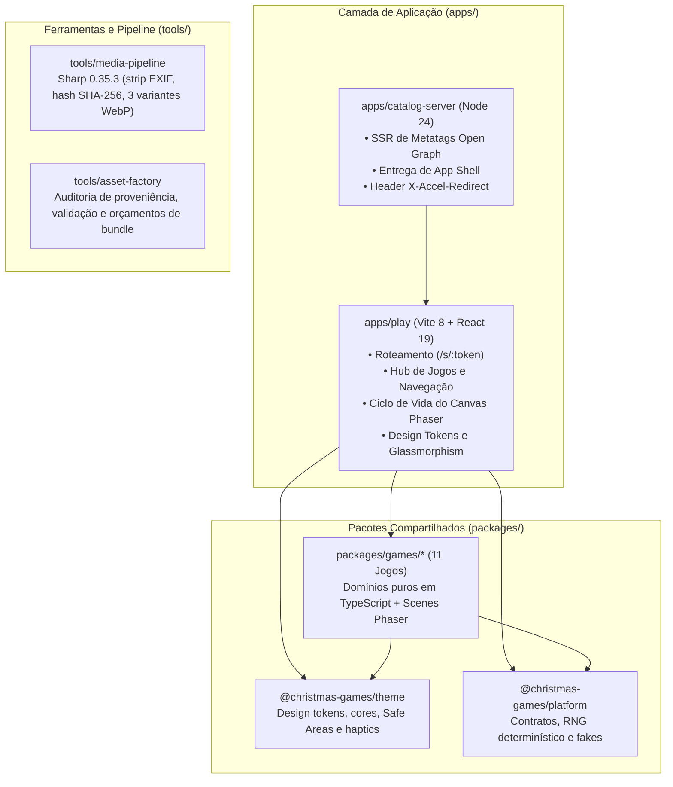

# 🎄 Christmas Games — Fábrica de Jogos Natalinos Personalizados

[](https://github.com/hypeneural/gameplay/actions/workflows/ci.yml)
[](https://nodejs.org/)
[](https://pnpm.io/)
[](https://phaser.io/)
[](https://react.dev/)

> **Mobile-first, deterministic photo minigames factory built for Christmas portrait sessions.**
>
> Arquitetura de ponta para celular (iOS Safari & Android Chrome), orquestrando **Phaser 4.2.1 + React 19** com isolamento estrito de domínio, pipeline de mídia seguro (Sharp), testes automatizados de ponta a ponta e planejamento de infraestrutura para galerias de clientes.

---

## 📸 Visão Geral

O **Christmas Games** é uma plataforma de experiências interativas natalinas desenvolvida para o **Estúdio Evydência**. A proposta é permitir que famílias recebam um link da sessão e que adultos e crianças descubram e brinquem com as fotos do seu próprio ensaio através de uma suíte de jogos com acabamento visual impecável, feedback tátil (haptics), áudio espacial festivo e física realista.

### 🌟 Pilares de Engenharia

- 📱 **Mobile-First & Touch-Native:** Interface desenhada para celulares modernos, com áreas de toque confortáveis (mínimo de `72px`), respeito estrito às _Safe Areas_ (notch e barras de navegação) e meta de 60 FPS, a validar nos aparelhos de destino.
- 🔒 **Privacidade de Dados & Mídia Segura:** Fotos originais em alta resolução nunca são servidas ou expostas à internet. O pipeline Node/Sharp faz a higienização de metadados EXIF e gera derivadas WebP com hash criptográfico SHA-256 servidas sob demanda.
- 🧩 **Domínios Puros & Determinismo:** Cada jogo possui um módulo `domain/` desacoplado de React, DOM e Phaser. Regras de física, pontuação e estado são 100% testáveis via sementes pseudoaleatórias previsíveis.
- 🧹 **Zero Memory Leak Lifecycle:** Um único ciclo de vida do Phaser é instanciado na entrada do jogo e completamente destruído ao sair (`game.destroy(true)`), liberando texturas WebGL, listeners de toque e instâncias de Web Audio.
- ⚡ **Implantação planejada:** A documentação descreve a proposta de hospedagem isolada. A validação do repositório não comprova implantação, disponibilidade ou capacidade da VPS.

---

## 🎮 Catálogo de Jogos Implementados

O repositório abriga 11 experiências interativas exclusivas:

| Jogo                             | Pacote                      | Mecânica Central & Dinâmica Fotográfica                                                                                                           | Estilo Visual & Áudio                                                                         |
| :------------------------------- | :-------------------------- | :------------------------------------------------------------------------------------------------------------------------------------------------ | :-------------------------------------------------------------------------------------------- |
| **A Lanterna Mágica**            | `lanterna-magica`           | O jogador direciona o facho de uma lanterna de latão clássica com física de reflexão em espelhos para sobrecarregar e revelar o retrato familiar. | Iluminação 2.5D volumétrica, partículas de poeira dourada, estalos de chama e harpa natalina. |
| **Globo das Lembranças**         | `globo-das-lembrancas`      | Globo de neve interativo onde o usuário dá corda para agitar a nevasca e limpa o vidro embaçado com os dedos para descobrir a foto.               | Vidro de cristal procedural, caixinha de música analógica e condensação dinâmica de vapor.    |
| **Estilingue das Lembranças**    | `estilingue-das-lembrancas` | Disparo de bolas de Natal com elásticos tracionados e trajetória parabólica para quebrar molduras de gelo que protegem as fotos.                  | Física elástica tátil, impacto de estilhaçamento de gelo com efeito _slow-motion_ e sinos.    |
| **A Magia da Minha Foto**        | `magic-photo`               | Desembrulho de fita de cetim vermelha com raspadinha de gelo cristalino para revelar a foto principal da família.                                 | Partículas de geada, brilho estelar cintilante e sino festivo de celebração.                  |
| **Quebra-Cabeça de Natal**       | `puzzle-swap`               | Troca tátil de peças em grade para remontar o retrato natalino da família com feedback de encaixe magnético.                                      | Moldura de madeira nobre talhada, feedback de encaixe suave e aplausos calorosos.             |
| **Memória de Veludo**            | `memory`                    | Jogo da memória com cartas de veludo rubi e arabescos dourados, descobrindo pares idênticos de fotos da sessão.                                   | Virada suave de cartas 3D, estalos agradáveis de papel cartão e harpa mágica.                 |
| **Expresso das Fotos**           | `expresso-das-fotos`        | Locomotiva a vapor natalina que percorre trilhos nevados entregando as fotos da família nas estações corretas.                                    | Fumaça volumétrica, apito de trem clássico e tilintar de carrilhão.                           |
| **Guirlanda das Lembranças**     | `guirlanda-das-lembrancas`  | Montagem interativa de guirlanda de pinheiro, posicionando laços, pinhas e luzes pisca-pisca ao redor da foto.                                    | Folhagens orgânicas, lâmpadas incandescentes pulsantes e estalar de gravetos.                 |
| **Mosaico em Queda**             | `mosaico-em-queda`          | Tetrominós festivos caindo para completar linhas e iluminar vitrais coloridos contendo as fotos familiares.                                       | Estilo vitral gótico iluminado, rotação SRS responsiva e corais celestiais.                   |
| **Trinca de Natal**              | `tic-tac-toe`               | Jogo da velha natalino com inteligência artificial Minimax imbatível no nível Mestre e fotos dos filhos como peças.                               | Flocos de neve e estrelas de ouro, marcadores natalinos e jingles de vitória.                 |
| **Rudolph: Chuva de Lembranças** | `rena-das-lembrancas`       | A criança conduz Rudolph pelo toque para resgatar fotos emolduradas que caem e completar o Álbum de Natal.                                        | Céu boreal em paralaxe, voo dinâmico com vento de inverno e sinos de trenó.                   |

---

## 🏗️ Arquitetura do Monorepo

O projeto adota uma arquitetura em camadas estritamente isoladas, garantindo que regras de negócio, renderização gráfica e infraestrutura nunca se misturem:



### 📋 Fronteiras Arquiteturais Inegociáveis (`AGENTS.md`)

1. **Domínio Puro:** Os arquivos dentro de `packages/games/<game>/src/domain/` **não podem** importar Phaser, React, DOM, `window`, `Date.now` ou `Math.random`. Toda a aleatoriedade deve ser injetada via sementes determinísticas.
2. **Isolamento de Jogos:** Um jogo **nunca** importa outro jogo. `platform` e `theme` **nunca** importam jogos.
3. **Ponte Unidirecional:** O React recebe apenas eventos tipados da ponte (`GameBridge`), nunca referências diretas a `Scene` ou instâncias do `Phaser.Game`.
4. **Ciclo de Vida Limpo:** Instancia-se apenas um jogo Phaser por vez. Ao sair da tela, remove-se todos os listeners, liberam-se as texturas alocadas e chama-se `game.destroy(true)`.
5. **Segurança de Mídia:** Nunca exponha caminhos de arquivos locais ou fotos originais. Todas as mídias passam por rotas controladas e validadas.

---

## 🚀 Início Rápido (Quickstart)

### Pré-requisitos

- **Node.js:** Versão `>=24.0.0 <25`
- **pnpm:** Versão `11.19.0`
- **Corepack:** Habilitado no sistema operacional

### 1. Clonar e Instalar Dependências

```bash
git clone https://github.com/hypeneural/gameplay.git
cd gameplay

# Habilitar Corepack e instalar dependências do workspace
corepack enable
pnpm install --frozen-lockfile
```

### 2. Gerar Fixtures e Iniciar o Ambiente Local

```bash
# Gerar fotos sintéticas de teste locais
pnpm fixtures:generate

# Iniciar o servidor de desenvolvimento do Hub e jogos
pnpm dev
```

O ambiente estará disponível em:

- **Hub de Jogos (Sessão de Demonstração):** `http://localhost:5173/s/local-demo-token`
- **Galeria Natalina:** `http://localhost:5173/s/local-demo-token/fotos`
- **Laboratório Visual de Temas:** `http://localhost:5173/__dev/theme`

Para validar uma pasta real de fotos sem Python/EvydFlow:

```bash
pnpm gallery:lab --source "<pasta-de-fotos>"
```

Antes de qualquer tarefa automatizada, `pnpm agent:doctor` informa o estágio permitido e os bloqueadores atuais.

---

## 🛡️ Portões de Qualidade & Comandos do Monorepo

O repositório conta com uma esteira rigorosa de verificação estática e testes automatizados:

| Comando               | Descrição da Operação                                                                                                                 | Tempo Médio |
| :-------------------- | :------------------------------------------------------------------------------------------------------------------------------------ | :---------- |
| `pnpm agent:doctor`   | Valida estágio, comandos canônicos e contradições de readiness para agentes/automação.                                                         | ~1s         |
| `pnpm check:fast`     | Executa TypeScript (`tsc`), Linter (`eslint`) e todos os testes unitários (`vitest`).                                                 | ~20s        |
| `pnpm check`          | Portão completo: `check:fast` + regras arquiteturais (`depcruise`), deadcode (`knip`), formatação (`prettier`) e mapa do repositório. | ~35s        |
| `pnpm test:e2e`       | Bateria de testes de ponta a ponta no navegador headless via **Playwright**.                                                          | ~60s        |
| `pnpm validate`       | Validação máxima de pré-merge: `check` + build de produção + `test:e2e`.                                                              | ~90s        |
| `pnpm build`          | Build normal fail-closed: compila web + catalog-server, mas não habilita sessão privada real.                                          | ~15s        |
| `pnpm release:staging`| Gera o artifact sintético e imutável para VPS staging-demo.                                                                           | variável    |
| `pnpm release:verify` | Recalcula inventário/bytes/SHA-256 e rejeita alteração ou arquivo proibido no artifact.                                                | ~1s         |
| `pnpm repo:map`       | Sincroniza e regenera o índice topológico de arquivos em `docs/generated/repo-map.md`.                                                | ~2s         |
| `pnpm asset:validate` | Valida integridade, proveniência e orçamento de todos os assets gráficos e sonoros.                                                   | ~3s         |

---

## 🌐 Produção e Implantação na VPS

O dimensionamento para **600 a 800 galerias de famílias** é uma proposta de arquitetura, sujeita a testes de carga e à integração do backend.

O repositório já produz um artifact **VPS staging-demo** com dados exclusivamente sintéticos, catalog-server compilado, health check, templates systemd/Nginx e inventário SHA-256. Esse estágio serve para colocar Hub/Galeria/Jogos no domínio real rapidamente, sem fotos de clientes.

O piloto real continua bloqueado por `deploy/readiness.json` até existir sessão persistente, grants, autorização de mídia privada, revisão atômica, backup/restore e validação mobile física. O caminho operacional está em [VPS_STAGING_DEMO_RUNBOOK.md](docs/ops/VPS_STAGING_DEMO_RUNBOOK.md).

Relatórios operacionais com endereços da infraestrutura e instruções de acesso são mantidos apenas localmente. Não fazem parte do repositório público.

---

## 📚 Mapa da Documentação

A documentação do projeto é centralizada e mantida em sincronia contínua:

- **[docs/index.md](docs/index.md)** — Índice geral de todos os documentos canônicos.
- **[Análise Forense Multi-Clientes (600 a 800 Galerias)](docs/architecture/PRODUCAO_VPS_MULTI_CLIENTES_600_800_GALERIAS.md)** — Capacidade de armazenamento, tempo de Sharp e banco SQLite WAL.
- **[Engenharia e Física dos Jogos Elaborados](docs/architecture/JOGOS_ELABORADOS_ENGENHARIA_LOGICAS_ASSETS_E_FISICA.md)** — Análise física da Lanterna Mágica, Globo de Neve e Estilingue.

---

## 🤝 Contribuição e Governança

Consulte o [CONTRIBUTING.md](CONTRIBUTING.md) para convenções de commits semânticos, criação de novos jogos natalinos (`pnpm game:new`) e procedimentos de abertura de Pull Requests.

---

<p align="center">
  Desenvolvido com carinho para as famílias do <b>Estúdio Evydência</b> 🎄✨
</p>
