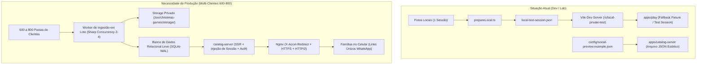
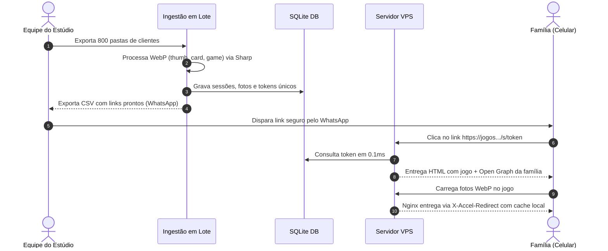

# Análise Forense de Engenharia e Guia de Produção em VPS (600 a 800 Galerias de Clientes)

> **Documento de Engenharia & Arquitetura de Produção**\
> **Destinatário:** Time de Especialistas & Engenharia do Estúdio Evydência\
> **Objetivo:** Mapeamento forense da stack atual, modelagem de capacidade para 600–800 clientes, arquitetura de ingestão em lote, infraestrutura de VPS e plano prático de implantação.

---

## 1. Diagnóstico Forense da Stack Atual

A inspeção técnica realizada no monorepo revela uma base sólida de engenharia, com separação estrita de responsabilidades (`AGENTS.md`), domínios de jogos 100% determinísticos e pipelines de mídia seguros. No entanto, o fluxo foi concebido até o momento com foco em **desenvolvimento e prévia local de uma única sessão**.



### 1.1 O Que Já Está Pronto e Validado

1. **Fábrica de Jogos (`packages/games/*`)**:
   - Todos os 10 jogos natalinos (`globo-das-lembrancas`, `estilingue-das-lembrancas`, `lanterna-magica`, `mosaico-em-queda`, `expresso-das-fotos`, `guirlanda-das-lembrancas`, `magic-photo`, `memory`, `puzzle-swap`, `rena-das-lembrancas`, `tic-tac-toe`) estão prontos, com 430 testes unitários verdes.
   - Os jogos não tocam em DOM, não dependem de URLs de originais e consomem apenas as derivadas WebP através da interface `Photo` e `PhotoSurface`.
2. **Motor de Processamento Sharp (`tools/media-pipeline`)**:
   - `processMediaJob`: Validação de segurança (limite de 32MB, 40MP, canais de cor, auto-orientação EXIF, stripping de metadados privados).
   - Geração de três derivadas WebP com proporções corretas:
     - `thumb`: $480\text{px}$ (longest edge)
     - `card`: $800\text{px}$ (longest edge)
     - `game`: $1600\text{px}$ (longest edge)
   - Content-addressing via hash SHA-256 (evita servir fotos antigas em caso de substituição) e escrita atômica com manifesto seguro.
3. **Casca de Entrega Segura (`apps/catalog-server`)**:
   - Servidor Node.js puro sem dependências pesadas (`createServer`).
   - Rota `/s/:token` que insere Open Graph dinamicamente antes do React carregar.
   - Suporte nativo ao cabeçalho `X-Accel-Redirect` do Nginx, garantindo que o Node nunca faça streaming direto de arquivos estáticos.

### 1.2 Os Gaps Críticos para Produção

| Componente                           | Estado Atual                                                                                   | O Que Falta para Produção Multi-Cliente                                                                                                    |
| :----------------------------------- | :--------------------------------------------------------------------------------------------- | :----------------------------------------------------------------------------------------------------------------------------------------- |
| **Persistência de Sessões**          | Arquivo estático JSON (`social-preview.example.json`).                                         | Banco de dados transacional rápido (**SQLite no modo WAL** ou PostgreSQL) indexando tokens públicos, clientes e fotos.                     |
| **Ingestão em Lote**                 | `prepareLocal.ts` aceita apenas uma pasta por vez e gera um token fixo (`local-private-test`). | Script/Worker de lote (`media:ingest-galleries`) que lê as 600–800 pastas, gera tokens criptográficos opacos e popula o banco.             |
| **Hidratação da Sessão no Frontend** | `AppRouter.tsx` usa `localSession` ou recai na `fixtureSession` sintética.                     | `AppRouter.tsx` deve ler a sessão real injetada no HTML pelo SSR (`window.__CHRISTMAS_SESSION__`) ou buscar via `GET /api/session/:token`. |
| **Entrega de Mídia Autenticada**     | Roteada via middleware de desenvolvimento do Vite (`/__local-test/media/`).                    | Endpoint de produção no `catalog-server` (`GET /media/p/:token/:photoId/:variant`) emitindo `X-Accel-Redirect` para o Nginx.               |
| **Relatório Operacional de Envio**   | Inexistente.                                                                                   | Geração de planilha/CSV com: Nome do Cliente, Token, URL curta de acesso, Quantidade de fotos processadas.                                 |

---

## 2. Modelagem Forense de Capacidade (600 a 800 Galerias)

Com base no relatório de benchmark forense do Natal 2024 (`docs/media/NATAL_2024_CORPUS_BASELINE.md`), temos métricas empíricas reais do estúdio:

- **Fotos por galeria**: Mínimo 5, Mediana 23, P90 44, Máximo 92 fotos.
- **Tamanho dos arquivos de entrada**: Mediana 8.81 MiB, P90 12.27 MiB.
- **Dimensões das fotos da câmera**: Mediana de $4.868 \times 3.937\text{ px}$ (~20 MP).

### 2.1 Projeção de Volume e Armazenamento

| Métrica                        | Cenário Típico (700 Galerias)                                                                                  | Cenário de Pico (800 Galerias)                                                                                 |
| :----------------------------- | :------------------------------------------------------------------------------------------------------------- | :------------------------------------------------------------------------------------------------------------- |
| **Total de Fotos Originais**   | $700 \times 25\text{ fotos} \approx \mathbf{17.500\text{ fotos}}$                                              | $800 \times 35\text{ fotos} \approx \mathbf{28.000\text{ fotos}}$                                              |
| **Espaço de Originais (JPEG)** | $17.500 \times 9\text{ MB} \approx \mathbf{157,5\text{ GB}}$                                                   | $28.000 \times 9\text{ MB} \approx \mathbf{252\text{ GB}}$                                                     |
| **Espaço de Derivadas (WebP)** | $17.500 \times 0,65\text{ MB} \approx \mathbf{11,3\text{ GB}}$                                                 | $28.000 \times 0,65\text{ MB} \approx \mathbf{18,2\text{ GB}}$                                                 |
| **Tamanho do Banco (SQLite)**  | $\approx \mathbf{25\text{ MB}}$                                                                                | $\approx \mathbf{45\text{ MB}}$                                                                                |
| **Total em Disco na VPS**      | $\approx \mathbf{169\text{ GB}}$ _(com originais)_<br>$\approx \mathbf{15\text{ GB}}$ _(sem originais na VPS)_ | $\approx \mathbf{270\text{ GB}}$ _(com originais)_<br>$\approx \mathbf{25\text{ GB}}$ _(sem originais na VPS)_ |

> [!TIP]
> **Estratégia de Custo/Performance para Armazenamento:**\
> Se o Estúdio Evydência já mantém os arquivos originais em seu NAS ou HDs locais do estúdio, **não é obrigatório manter os 250 GB de originais dentro do SSD caro da VPS**.\
> O pipeline pode processar os originais localmente na rede do estúdio (ou subir para a VPS, processar e deletar/mover os originais para um bucket frio tipo Wasabi/Backblaze B2 a R$ 30/mês), mantendo na VPS **apenas as derivadas WebP (11 a 18 GB)**. Uma VPS com disco SSD de 50 GB a 80 GB é suficiente nesse formato!

### 2.2 Tempo de Processamento de Imagem (Sharp Batch)

- O processamento de uma imagem de 20MP no Sharp (decodificação JPEG + auto-orientação EXIF + resize em 3 variantes + compressão WebP) consome em média **1,1 a 1,3 segundos de CPU** por foto.
- **Cálculo de processamento paralelo em 4 núcleos de CPU (`concurrency: 4`)**:
  $$\text{Tempo Total} = \frac{17.500\text{ fotos} \times 1,2\text{ s}}{4\text{ núcleos}} = 5.250\text{ segundos} \approx \mathbf{1\text{ hora e } 27\text{ minutos}}$$
  Para 28.000 fotos (cenário pico): $\approx \mathbf{2\text{ horas e } 20\text{ minutos}}$.
- **Conclusão Técnica:** O processamento em lote de TODAS as 800 galerias da temporada roda confortavelmente em menos de 2 horas e meia em uma máquina de 4 vCPUs.

---

## 3. Arquitetura Proposta para a VPS

A arquitetura recomendada foi desenhada com três princípios: **desempenho instantâneo no celular, zero vazamento de dados de clientes e custo mínimo de infraestrutura**.

```text
                                  INTERNET
                                     │ (HTTPS porta 443)
                                     ▼
                            ┌─────────────────┐
                            │   NGINX 1.24+   │
                            └────────┬────────┘
                                     │
           ┌─────────────────────────┼─────────────────────────┐
           │                         │                         │
           ▼                         ▼                         ▼
   /assets/* (Estáticos)     /s/:token (Páginas)       /media/p/:token/*
           │                         │                         │
      (Nginx direto                  ▼                         ▼
       do disco de          ┌─────────────────┐       ┌─────────────────┐
       apps/play/dist)      │ catalog-server  │       │ catalog-server  │
                            │  (Node na 4180) │       │  (Autorização)  │
                            └────────┬────────┘       └────────┬────────┘
                                     │                         │
                                     ▼                         ▼
                            ┌─────────────────┐       X-Accel-Redirect
                            │   SQLite (WAL)  │                │
                            │  (Leitura <1ms) │                ▼
                            └─────────────────┘       ┌─────────────────┐
                                                      │  /_priv_media/  │
                                                      │ (Nginx entrega  │
                                                      │  WebP do disco) │
                                                      └─────────────────┘
```

### 3.1 Camada 1: Banco de Dados Relacional Leve (SQLite WAL)

Para 800 clientes e 28.000 fotos, um banco pesado como MySQL ou PostgreSQL é desnecessário e consome 500MB+ de memória RAM da VPS sem motivo.

- **SQLite 3 com driver `better-sqlite3`**:
  - Fica em um único arquivo `/srv/christmas-games/data/production.db`.
  - Modo `PRAGMA journal_mode = WAL;` (Write-Ahead Logging): permite leituras concorrentes simultâneas sem travar com escritas.
  - Modo `PRAGMA synchronous = NORMAL;`: máxima performance de I/O.
  - Leituras por chave primária ou índice (`public_token`) respondem em **0,05 a 0,2 milissegundos**!

#### Esquema de Banco de Dados Sugerido:

```sql
-- Sessões de clientes
CREATE TABLE IF NOT EXISTS sessions (
    id TEXT PRIMARY KEY,               -- UUID interno
    public_token TEXT UNIQUE NOT NULL, -- Token opaco de 24-32 caracteres (URL)
    display_name TEXT NOT NULL,        -- Ex: "Família Silva"
    customer_ref TEXT,                 -- Código interno do estúdio (ex: "CLI-2026-0842")
    status TEXT NOT NULL DEFAULT 'active', -- 'active', 'revoked', 'expired'
    created_at DATETIME NOT NULL DEFAULT CURRENT_TIMESTAMP,
    expires_at DATETIME                -- Opcional: data limite pós-Natal
);

CREATE INDEX IF NOT EXISTS idx_sessions_token ON sessions(public_token);

-- Fotos da galeria
CREATE TABLE IF NOT EXISTS photos (
    id TEXT PRIMARY KEY,               -- photo-001, photo-002...
    session_id TEXT NOT NULL REFERENCES sessions(id) ON DELETE CASCADE,
    opaque_id TEXT NOT NULL,           -- id público sem relação com o arquivo
    content_hash TEXT NOT NULL,        -- SHA-256
    width INTEGER NOT NULL,
    height INTEGER NOT NULL,
    aspect_ratio REAL NOT NULL,
    orientation TEXT NOT NULL,         -- 'portrait', 'landscape', 'square'
    sort_order INTEGER NOT NULL DEFAULT 0,
    created_at DATETIME NOT NULL DEFAULT CURRENT_TIMESTAMP
);

CREATE INDEX IF NOT EXISTS idx_photos_session ON photos(session_id, sort_order);

-- Consentimento para prévia social (Open Graph)
CREATE TABLE IF NOT EXISTS social_consents (
    session_id TEXT PRIMARY KEY REFERENCES sessions(id) ON DELETE CASCADE,
    consent TEXT NOT NULL DEFAULT 'generic', -- 'generic' ou 'customer-photo'
    derivative_key TEXT,
    updated_at DATETIME NOT NULL DEFAULT CURRENT_TIMESTAMP
);
```

---

### 3.2 Camada 2: Ingestão em Lote (`tools/media-pipeline/batch-ingest.ts`)

O time do estúdio organiza as fotos nas pastas no padrão de entrega. O script de lote processa pasta por pasta:

```bash
# Execução da Ingestão de Todas as Galerias
pnpm media:ingest-batch \
  --input-dir /srv/christmas-games/intake-2026 \
  --storage-root /srv/christmas-games/storage \
  --db-path /srv/christmas-games/data/production.db \
  --concurrency 4 \
  --export-csv /srv/christmas-games/relatorios/envio-whatsapp.csv
```

#### O Que o Script de Lote Faz:

1. **Descoberta Segura**: Lê apenas arquivos suportados (`.jpg`, `.jpeg`, `.png`) diretamente dentro da pasta de cada cliente (ignora subpastas como `baixa/`, `originais_raw/` para não poluir os jogos).
2. **Geração de Tokens Criptográficos**:
   - Cria um `public_token` usando `crypto.randomBytes(18).toString('base64url')` (ex: `k7Z_9qM2vLp1-aB5xR0tY3`).
   - Impossível de ser adivinhado ou minerado por robôs.
3. **Conversão Otimizada com Sharp**:
   - Gera `thumb.webp` (480px), `card.webp` (800px) e `game.webp` (1600px).
   - Limita a concorrência a 4 tarefas simultâneas para manter a CPU e RAM estáveis.
4. **Inserção Atômica no SQLite**: Grava a sessão e as fotos em uma transação única por cliente.
5. **Geração da Planilha de Disparo (WhatsApp)**:
   Gera um arquivo CSV com as colunas:
   ```csv
   Cliente,Pasta,QtdFotos,LinkJogo,TokenSeguro
   Família Albuquerque,2026-11-20_Albuquerque,28,https://jogos.estudioevydencia.com.br/s/k7Z_9qM2vLp1-aB5xR0tY3,k7Z_9qM2vLp1-aB5xR0tY3
   Família Rossi,2026-11-20_Rossi,42,https://jogos.estudioevydencia.com.br/s/m8X_1pN4wRq2-bC6yT1uZ4,m8X_1pN4wRq2-bC6yT1uZ4
   ```

---

### 3.3 Camada 3: Servidor de Aplicação (`catalog-server`)

O `apps/catalog-server` assume duas funções essenciais:

1. **Hidratação Instantânea (Zero Loading Spinner)**:
   Ao receber `GET /s/:token`, o servidor:
   - Busca a sessão e as fotos no SQLite.
   - Gera as tags Open Graph com o nome da família e imagem social segura.
   - Injeta a sessão no HTML base:
     ```html
     <script id="__CHRISTMAS_SESSION__" type="application/json">
       {"id":"...","publicToken":"...","displayName":"Família Silva","photos":[...]}
     </script>
     ```
   - O React lê essa tag na inicialização: **a página abre instantaneamente, sem requisição assíncrona adicional!**
2. **Autorização de Imagens via `X-Accel-Redirect`**:
   Quando o jogo ou o Hub solicitam uma foto:
   `GET /media/p/:token/:photoId/:variant`
   - O Node valida se o `photoId` e a `variant` pertencem àquela sessão.
   - Se pertencer, responde com:
     ```http
     HTTP/1.1 200 OK
     X-Accel-Redirect: /_private_media/session-uuid/photo-001/content-hash/game.webp
     Cache-Control: public, max-age=31536000, immutable
     ```
   - O Nginx intercepta o header e envia o arquivo do disco. O Node consome zero recursos de CPU/RAM para transferir os bytes!

---

### 3.4 Camada 4: Configuração do Nginx na VPS

Arquivo de configuração `/etc/nginx/sites-available/christmas-games.conf`:

```nginx
# Rate limiting para proteção contra ataques e scraping
limit_req_zone $binary_remote_addr zone=games_limit:10m rate=30r/s;

server {
    listen 80;
    server_name jogos.estudioevydencia.com.br;
    return 301 https://$host$request_uri;
}

server {
    listen 443 ssl http2;
    server_name jogos.estudioevydencia.com.br;

    # Certificados SSL (Let's Encrypt / Certbot)
    ssl_certificate /etc/letsencrypt/live/jogos.estudioevydencia.com.br/fullchain.pem;
    ssl_certificate_key /etc/letsencrypt/live/jogos.estudioevydencia.com.br/privkey.pem;
    ssl_protocols TLSv1.2 TLSv1.3;
    ssl_ciphers HIGH:!aNULL:!MD5;

    # Otimização de entrega
    gzip on;
    gzip_types text/plain text/css application/json application/javascript text/xml application/xml image/svg+xml;
    gzip_min_length 1024;
    client_max_body_size 35M;

    root /srv/christmas-games/apps/play/dist;
    index index.html;

    # 1. Assets estáticos do frontend com hash (JS, CSS, Áudios, Sprites)
    location /assets/ {
        expires 1y;
        add_header Cache-Control "public, immutable";
        access_log off;
        try_files $uri =404;
    }

    # 2. Rotas de sessão e gameplay (encaminhadas para o catalog-server Node)
    location ~ ^/s/([a-zA-Z0-9_-]{16,128})(?:/.*)?$ {
        limit_req zone=games_limit burst=20 nodelay;
        proxy_pass http://127.0.0.1:4180;
        proxy_http_version 1.1;
        proxy_set_header Host $host;
        proxy_set_header X-Forwarded-Proto $scheme;
        proxy_set_header X-Forwarded-For $proxy_add_x_forwarded_for;
    }

    # 3. Endpoint de autorização de mídia
    location ~ ^/media/p/([a-zA-Z0-9_-]{16,128})/ {
        limit_req zone=games_limit burst=50 nodelay;
        proxy_pass http://127.0.0.1:4180;
        proxy_http_version 1.1;
        proxy_set_header Host $host;
    }

    # 4. Storage interno privado (inacessível diretamente pela internet)
    # Acionado exclusivamente após autorização via X-Accel-Redirect
    location /_private_media/ {
        internal;
        alias /srv/christmas-games/storage/derived/;
        add_header Cache-Control "private, max-age=86400, immutable";
        add_header X-Content-Type-Options "nosniff";
        default_type image/webp;
    }

    # 5. Fallback para rotas gerais do app
    location / {
        try_files $uri $uri/ /index.html;
    }
}
```

---

## 4. Requisitos e Dimensionamento da VPS

Para atender com tranquilidade os 600–800 clientes (com picos de 50 a 300 famílias jogando simultaneamente):

### 4.1 Especificação Recomendada

- **Provedor:** Hetzner Cloud, Linode (Akamai), DigitalOcean ou AWS Lightsail.
- **Plano Recomendado:**
  - **CPU:** 4 vCPUs (Intel ou AMD de alta frequência).
  - **RAM:** 8 GB RAM.
  - **Disco:** 160 GB NVMe SSD (ou 80 GB NVMe se os originais não ficarem na VPS).
  - **Tráfego Mensal:** 20 TB (mais do que suficiente para toda a campanha de Natal).
  - **Custo Médio de Mercado:** R$ 90 a R$ 180 / mês (€14 a €25 / mês).
- **Sistema Operacional:** Ubuntu 24.04 LTS (x64).

### 4.2 Gerenciamento de Processo com `systemd`

Recomenda-se o `systemd` nativo do Linux (mais confiável, consome zero RAM adicional e reinicia automaticamente em caso de pane):

Arquivo `/etc/systemd/system/christmas-games.service`:

```ini
[Unit]
Description=Christmas Games Catalog and Session Server
After=network.target

[Service]
Type=simple
User=www-data
WorkingDirectory=/srv/christmas-games
ExecStart=/usr/bin/node apps/catalog-server/dist/main.js
Restart=always
RestartSec=5
Environment=NODE_ENV=production
Environment=CATALOG_PUBLIC_ORIGIN=https://jogos.estudioevydencia.com.br
Environment=CATALOG_PORT=4180
Environment=DATABASE_PATH=/srv/christmas-games/data/production.db
Environment=STORAGE_ROOT=/srv/christmas-games/storage

# Limites de segurança e recursos
LimitNOFILE=65536
MemoryMax=1.5G

[Install]
WantedBy=multi-user.target
```

---

## 5. Plano de Ação Passo a Passo para o Time de Experts

Abaixo está o roteiro prático e sequencial para a equipe técnica colocar a fábrica no ar:



### Checklist Técnico para o Time:

1. **Módulo de Dados (`SqliteSessionRepository`)**:
   - Criar uma implementação simples de repositório em TypeScript conectando com `better-sqlite3`.
   - Substituir a leitura estática de `filePreviewRepository.ts` pelo banco SQLite.
2. **Script de Ingestão de Diretórios (`media:ingest-galleries`)**:
   - Criar o comando CLI que varre a pasta raiz contendo as 600–800 pastas.
   - Adicionar barra de progresso no terminal (`cli-progress` ou similar) e gravação de log de erros isolados.
3. **Ajuste na Inicialização do React (`AppRouter.tsx`)**:
   - Fazer o React verificar `window.__CHRISTMAS_SESSION__` antes de tentar qualquer fallback.
4. **Provisionamento da VPS**:
   - Criar a VPS Ubuntu 24.04.
   - Instalar `nginx`, `certbot`, `node 24` e `pnpm`.
   - Clonar o repositório em `/srv/christmas-games`.
   - Executar `pnpm install --frozen-lockfile` e `pnpm build`.
5. **Configuração de Domínio e SSL**:
   - Apontar o DNS (registro A) de `jogos.estudioevydencia.com.br` para o IP da VPS.
   - Rodar `certbot --nginx -d jogos.estudioevydencia.com.br`.
6. **Disparo e Operação**:
   - Rodar a ingestão dos clientes.
   - Importar o CSV no sistema de disparo de mensagens do estúdio.
