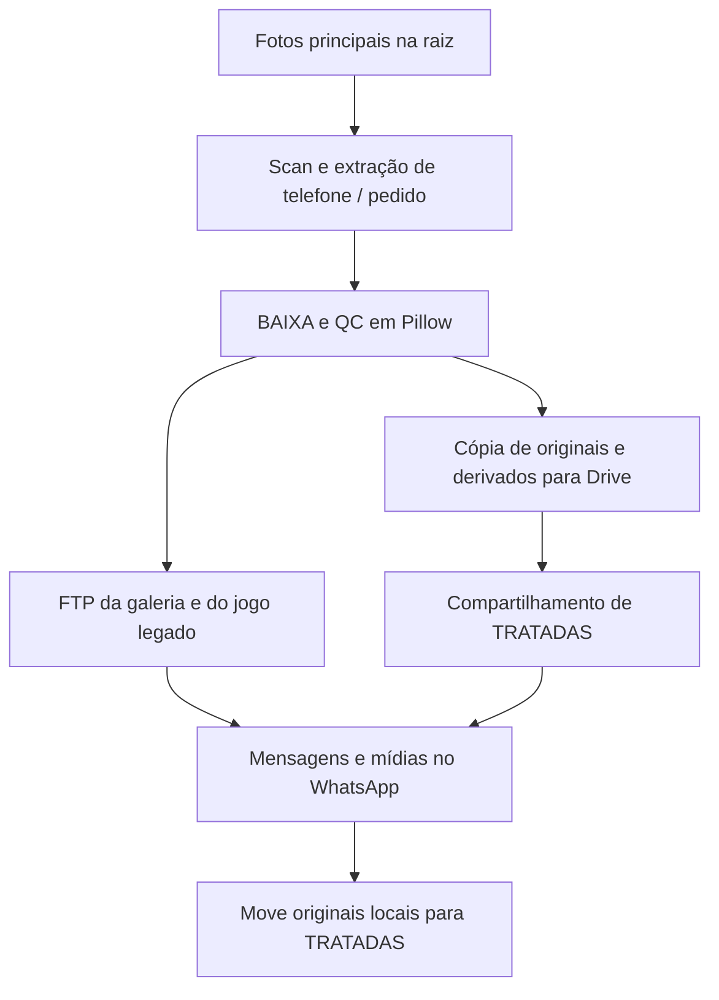
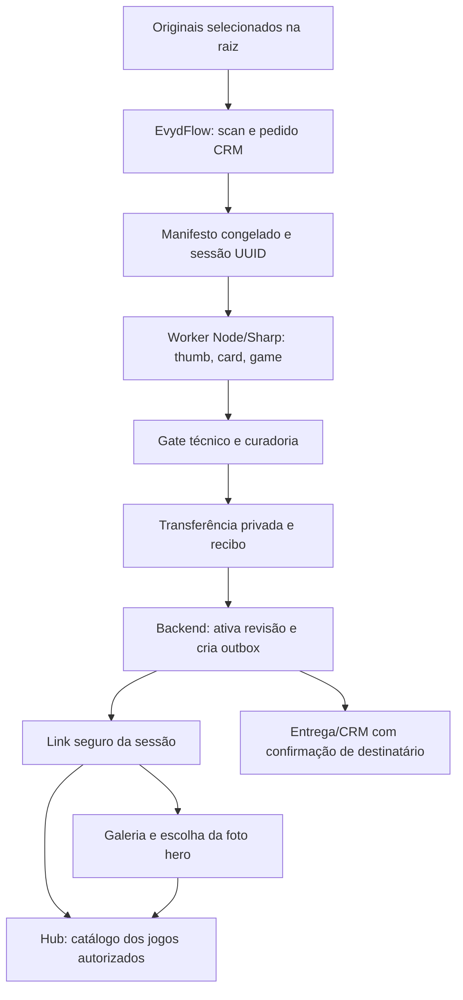

# Sessões de fotos, galeria e múltiplos jogos

**Edição pública anonimizada - 05/10/2026.** O pedido `5000` e os nomes `foto-NN.jpg` são exemplos fictícios; não identificam o cliente da bancada. As medições agregadas permanecem reais. Fotografias, nomes, telefones, caminhos locais e hashes individuais de mídia foram omitidos. Artefatos privados mencionados na auditoria não acompanham esta edição; consultar `evidence/benchmark-summary.json` e `evidence/source-index.json` para os recibos públicos. A documentação registra fatos e propostas, não uma integração já implantada.

## Auditoria forense e arquitetura operacional recomendada

**Evydência | Caso de referência: pedido 5000 | 05/10/2026 | Versão 2.0 - três repositórios e plano de implementação**

**Classificação: documentação técnica pública anonimizada.** Status: auditoria local concluída, otimização medida em bancada e proposta de integração; publicação de sessão, consulta real ao CRM e envio ao cliente não foram executados.

### Decisão recomendada

Manter o **EvydFlow como orquestrador**, reaproveitar o **worker Node/Sharp do projeto de jogos como único responsável pelas versões web** e criar **uma sessão fotográfica persistente, com galeria e catálogo compartilhados pelos jogos**. O número final da pasta é a referência interna do pedido no CRM, preservada integralmente. A URL entregue à família usa um token aleatório independente desse número.

A galeria completa deve ser uma rota da própria `gameplay`, em **`/s/:token/fotos`**, reaproveitando a experiência de `festive-gallery-show` e os componentes `PhotoPrint`/`SessionPhotoAlbum`. O Hub em `/s/:token` permanece compacto; os jogos continuam em `/s/:token/game/:gameId`. Trata-se de um aplicativo e uma autoridade de sessão, não de dois sistemas que processam e armazenam as mesmas fotos.

Para o caso 5000, usar somente os **30 arquivos principais diretamente na raiz**. As 30 imagens de `BAIXA` não entram como origem do novo processamento. Galeria e jogos devem receber derivados dos mesmos originais, com os mesmos IDs de fotografia e a mesma revisão de sessão.

**Resultado medido:** 314,66 MB de entrada produziram 90 WebP, somando 6,62 MB, em 21,75 segundos nesta máquina. A redução do conjunto de derivados em relação aos originais foi de 97,90%. Os originais continuaram intactos. Isso demonstra a viabilidade do processamento local; não representa um teste de carga de produção ou de toda a experiência de cada jogo.

<!-- pagebreak -->

## 1. Escopo, método e força das evidências

Foram inspecionados: a pasta fornecida do cliente; os workflows, tasks, fila, estado e integrações em `<repo-evydflow>`; os contratos de fotos/sessões, aplicativo, servidor de catálogo e pipeline de mídia em `<repo-gameplay>`; e o repositório privado `hypeneural/festive-gallery-show`, clonado para leitura e verificação na pasta `reference-repos` desta auditoria. O texto colado pelo solicitante foi usado como hipótese/checklist e confrontado com as fontes.

A pasta de referência é:

```text
<origem-privada>\<nome> - <telefone> - Experiência Então é Natal - 5000
```

O solicitante informou que o sufixo `5000` corresponde ao ID do pedido do CRM. Isso foi adotado como regra de negócio de entrada. **A existência, o UUID, o status comercial e o destinatário desse pedido não foram consultados no CRM real.** O contrato remoto necessário para resolver um número de pedido em UUID continua sendo uma pendência de integração.

A inspeção foi estática nos sistemas operacionais. Nenhum flow de produção foi executado, nenhum original foi movido, nenhuma permissão do Drive foi alterada, nenhum upload foi feito e nenhuma mensagem foi enviada. Os arquivos reais de secrets, `.env` e credenciais não foram lidos. Apenas a bancada isolada de mídia e a galeria offline foram executadas.

### Registro de versões

| Sistema         | Versão observada                                    | Observação                                                                             |
| --------------- | --------------------------------------------------- | -------------------------------------------------------------------------------------- |
| Jogos           | `e38573b46d841f9cea1ab5f7306b0fd254b511ca`          | Repositório sincronizado; código de mídia reutilizado na bancada.                      |
| EvydFlow        | `42f0bcfd562d3165362cba39f1adb7bc5856d3af`          | Refresh dos achados contra este commit; outros trabalhos continuam alterando SoClique. |
| Galeria React   | `0f903fba53d0e33c62cd3aa32f1cb25e8489390b`          | `hypeneural/festive-gallery-show`, branch `main`; clone privado de referência.         |
| Sharp / libvips | `0.35.3` / `8.18.3`                                 | Versões efetivamente usadas no experimento.                                            |
| Bancada         | Duas fotos em processamento; `sharp.concurrency(1)` | Controle conservador de recursos, não uma configuração universal.                      |

Na etapa inicial, o EvydFlow estava em `0c99818` com alterações locais. Outro trabalho commitou essas alterações em `42f0bcf`; os achados centrais foram reconferidos, e os arquivos do scan, ID, imagens, FTP, Drive, CRM e runner legado não mudaram entre essas referências. Depois do refresh, novos edits em `soclick/models.py` e `soclick/storage.py` foram observados. Os detalhes de SoClique são referências ao snapshot/commit inspecionado, não promessa sobre futuras alterações. A auditoria não escreveu no código do EvydFlow. Snapshots, hashes e estados de captura foram preservados em `evidence/source-snapshots` e `evidence/source-receipts.json`; o recibo inicial também permanece disponível.

Neste documento, **observado** significa comportamento comprovado por código ou medição; **risco** é a consequência possível desse comportamento; **proposto** é uma alteração ainda não implementada. A classificação não afirma que houve incidente de vazamento ou falha operacional em produção.

## 2. Inventário real da sessão 5000

| Item                                       | Resultado observado                                                       |
| ------------------------------------------ | ------------------------------------------------------------------------- |
| Origem selecionada                         | Arquivos diretamente na raiz da pasta do cliente.                         |
| Fotos principais                           | 30 JPEG; 314.662.440 bytes, ou 314,66 MB.                                 |
| Subpasta excluída                          | `BAIXA`: 30 arquivos, 20.638.181 bytes, ou 20,64 MB.                      |
| Orientação                                 | 25 horizontais e 5 verticais; nenhuma quadrada.                           |
| Resolução                                  | De 7,89 a 22,40 megapixels.                                               |
| Tamanho por original                       | De 4.069.068 a 17.486.517 bytes.                                          |
| Metadados nos originais                    | 30 com EXIF, 30 com ICC e 30 com XMP.                                     |
| Orientação EXIF                            | Valor 1 em todos os arquivos desta amostra.                               |
| Duplicação exata                           | Nenhum par com o mesmo SHA-256 do arquivo original.                       |
| Candidatos a duas versões da mesma captura | `foto-13.jpg` e `foto-12.jpg`; mesmos 5425×3875 pixels, hashes distintos. |

Os dois arquivos de captura semelhante devem permanecer na seleção inicial. Nomes parecidos não comprovam duplicação visual. O fotógrafo pode escolher uma versão final durante a curadoria; o sistema não deve apagar ou fundir esses arquivos automaticamente.

O baseline histórico em `docs/media/NATAL_2024_CORPUS_BASELINE.md` registra 10.244 cabeçalhos de fotos, de 396 sessões não vazias: mediana de 23 fotos, P90 de 44, máximo de 92; 63,2% horizontais e 36,8% verticais. Esse documento foi lido, não houve nova varredura do acervo nesta auditoria. Ele é evidência de variedade de tamanho/orientação, não prova de decode completo daquele acervo. A nova galeria precisa trabalhar com 1, 5, 30, 92 e fixtures de estresse maiores, sem assumir um lote fixo de 30. [E17]

**Regra de seleção:** não fazer busca recursiva. `BAIXA`, `QC`, `TRATADAS`, `BRUTAS` e outras subpastas não entram nesta execução. Se uma pasta futura estiver vazia porque o legado moveu os originais para `TRATADAS`, a origem deve ser selecionada explicitamente pelo operador e registrada. Não procurar uma alternativa silenciosamente.

Unidades: MB e GB neste relatório são decimais, com 1 MB = 1.000.000 bytes. Os JSONs preservam os valores inteiros para reprodução dos cálculos.

<!-- pagebreak -->

## 3. Como o workflow atual realmente funciona

O EvydFlow já tem uma estrutura útil: DAG YAML, tasks reutilizáveis, retomada por step, fila e integrações de entrega. Porém, o flow legado associa processamento, publicação, comunicação e movimentação de originais na mesma cadeia.



### 3.1 Entrada e identidade

`fs.scan_inputs` usa `base.iterdir()`: varre apenas a raiz, atendendo à exclusão de `BAIXA`. Contudo, o filtro de extensões depende da capitalização declarada em settings. Também há um defeito quando `ignore_prefix` é omitido: o prefixo vazio pode excluir todos os arquivos. Os flows existentes informam `calendario`, evitando esse defeito nesse caminho específico. [E01]

`fs.extract_order_id` identifica os dígitos finais, mas usa `digits[-4:]` como `order_id` e diretório remoto. `order_id_full` preserva o valor completo. Para 5000, ambos coincidem; para 105000, o valor operacional seria 5000. O teste unitário atual deliberadamente cobre o truncamento. A regra precisa mudar no novo fluxo, sem migrar silenciosamente endereços antigos. [E01, E02]

O telefone é inferido do nome ou caminho da pasta. Isso não confirma que o número pertence ao titular do pedido nem que é o destinatário autorizado no CRM. Os YAMLs atuais não fazem reconciliação do pedido numérico com o CRM. A task `orders.detail` espera um UUID; `orders.search` oferece filtros, mas o filtro remoto correto para pesquisar o número 5000 não foi comprovado. [E03]

### 3.2 Imagens

O código de `images.generate_outputs` aplica orientação EXIF, converte para RGB e usa LANCZOS. Os defaults de código são BAIXA com lado maior de 2500 px e JPEG qualidade 93, com logo; e QC em canvas branco de 660×660 px. **QC é um encaixe proporcional com bordas, não um recorte quadrado da fotografia.** O default permite ampliar imagens pequenas em QC. Configurações externas reais podem alterar esses valores e não foram lidas. [E04]

BAIXA e QC são criadas dentro da origem e recebem nomes baseados no stem. Isso permite sobrescritas, colisões entre extensões e resíduos de execuções anteriores. Falhas individuais são logadas e toleradas; a função pode retornar sucesso parcial sem um gate de coleção completa. Preservar o ICC original em um arquivo convertido para RGB não equivale, por si só, a converter explicitamente o perfil para sRGB. [E04]

### 3.3 Entrega e estado

O FTP implementado é `ftplib.FTP`, com upload direto ao nome final. Não foi encontrada implementação de `FTP_TLS` nesse caminho. A documentação que promete TLS é mais forte que o código. Os links dos flows legados usam HTTP e número do pedido. [E05]

O ramo Drive copia originais para TRATADAS e compartilha essa pasta com `type=anyone`, `role=writer`. `allowFileDiscovery=false` limita descoberta, não restringe o acesso a uma pessoa. O código cria permissão de edição para quem possui o link. Não foram verificadas permissões reais já existentes no Drive. [E06]

O estado do runner não é uma transação de publicação. O fingerprint inclui bytecode `co_code` e YAML antes da renderização, mas não o conteúdo das imagens, a receita, as configurações, o logo ou os outputs das dependências. Os arquivos de estado são escritos diretamente. O cache pode considerar um step concluído sem conferir a integridade dos artefatos atuais. [E07]

O YAML descreve dependências, mas o runner executa steps em sequência. A fila genérica não demonstra lock exclusivo por sessão/revisão. Retries de steps de envio podem repetir mensagens ou mídias após um resultado remoto desconhecido. [E08]

No flow legado, a saudação inicial depende apenas do telefone e pode acontecer antes da coleção estar pronta. O novo fluxo deve colocar a intenção de entrega após a ativação da revisão, em vez de usar uma saudação como início de uma cadeia de efeitos externos.

## 4. Achados prioritários e tratamento

| ID  | Prioridade | Achado e consequência                                                                                     | Tratamento recomendado                                                                |
| --- | ---------- | --------------------------------------------------------------------------------------------------------- | ------------------------------------------------------------------------------------- |
| F01 | P0         | ID final truncado para quatro dígitos: pedidos diferentes podem compartilhar identidade e diretório.      | Preservar o número completo, resolver UUID do CRM e separar sessão/token.             |
| F02 | P0         | TRATADAS com originais é compartilhada como `anyone/writer`.                                              | Ramo de backup privado; entrega separada com acesso de leitura definido por política. |
| F03 | P0         | O aplicativo dos jogos usa fixtures fora do modo de teste local; não hidrata a sessão real de um cliente. | Repositório persistente, API autorizada e erro explícito para sessão inválida.        |
| F04 | P0         | Não há endpoint de mídia de produção implementado no servidor de catálogo auditado.                       | Autorizar sessão/foto/revisão/variante antes de servir o arquivo.                     |
| F05 | P0         | FTP sem TLS nesse código, nomes finais durante upload e links enumeráveis do legado.                      | Transferência autenticada e criptografada; staging, recibo e ativação atômica.        |
| F06 | P1         | Fingerprint do runner não representa conteúdo e receita; estado não transacional.                         | Manifesto congelado, hashes semânticos e ledger transacional.                         |
| F07 | P1         | Sucesso parcial de imagens, raiz vazia ou derivados antigos não bloqueiam toda a entrega.                 | Gate de revisão completa; falhas explícitas e nenhum envio antes de READY.            |
| F08 | P1         | Nomes de saída podem colidir; ordenação define IDs locais posicionais.                                    | IDs persistentes por fotografia e namespace imutável de versão.                       |
| F09 | P1         | Cache Sharp atual é baseado no original, sem identidade de receita.                                       | Incluir `recipeVersion` e parâmetros na chave dos derivados.                          |
| F10 | P1         | Sem lock genérico por sessão; retries de efeitos externos podem duplicar entrega.                         | Lease com fencing e outbox com reconciliação de resultado desconhecido.               |
| F11 | P1         | Fluxo legado move os originais após mensagens; reexecução pode encontrar raiz vazia.                      | Novo flow mantém origem intacta; arquivamento é operação separada.                    |
| F12 | P2         | Documentação promete estado atômico, TLS e invalidação mais abrangente que o código.                      | Atualizar documentação junto à implementação e aos testes que comprovam as garantias. |

P0 significa requisito a resolver antes da nova publicação para clientes. P1 bloqueia operação confiável e reprocessamento seguro. P2 exige correção e verificação, mas não prova incidente. Não foram alterados os flows nem as permissões durante esta auditoria.

<!-- pagebreak -->

## 5. O que o projeto de jogos já oferece e o que falta

### Base reutilizável

O contrato `Photo` já separa ID, dimensões, proporção, orientação e URLs de `thumb`, `card` e `game`. Há metadados opcionais normalizados de ponto focal e zona segura do rosto, sem reconhecimento no navegador. `Session` agrupa as fotos. Os jogos importam módulos dinamicamente, com um ciclo de vida de canvas por vez. [E09]

O worker `processMediaJob` valida arquivo, limita a entrada a 32 MiB e 40 milhões de pixels, usa orientação EXIF e produz WebP proporcionais de 480, 800 e 1600 px, qualidade 82, sem ampliação. A geração ocorre em staging e usa rename para publicar um conjunto de variantes local. O batch limita a concorrência e isola falhas. [E10]

### Lacunas de produção

`AppRouter` escolhe uma sessão local de teste ou `createFixtureSession`. Um endereço com token arbitrário não carrega automaticamente fotos reais. A implementação `InMemorySessionRepository` não é um banco de sessões de clientes. O servidor de catálogo entrega HTML/preview social; não implementa a API de sessão, autenticação da galeria ou endpoint das fotos. [E11]

`prepareLocalMedia` é uma ferramenta de teste: usa UUID fixo por default, token `local-private-test`, IDs definidos pela posição ordenada e uma única configuração local. É útil para bancada, mas não deve ser usado como registro multicliente. `media:inspect` foi desenhado para uma raiz de coleções de sessões; passá-lo diretamente à pasta individual pode tratar a subpasta BAIXA como sessão. O inventário desta auditoria foi explicitamente limitado aos arquivos imediatos da raiz. [E12]

O cache atual dos derivados inclui o hash do original, mas não o hash da receita. Se qualidade ou dimensões forem alteradas, um conjunto antigo ainda considerado válido pode ser reutilizado. A escrita do manifesto é atômica por arquivo, mas o merge pressupõe um escritor e pode perder atualizações concorrentes. Na cópia inicial do original, é necessário conferir o hash do snapshot copiado antes da promoção para evitar mudança da origem entre leitura do hash e cópia. São requisitos da extensão de produção, não falhas reproduzidas nas 30 fotos deste teste. [E10]

### 5.1 Galeria mobile real: o que portar e o que substituir

`festive-gallery-show` é um frontend React 18/Vite 5. A entrada usa `?id=<número>`, e `PhotoGallery` busca `photos.php?id=...` e `order.php?id=...`. O backend PHP desses endpoints não está no repositório clonado e não foi auditado. A ausência de autorização no frontend, por si só, não prova ausência de controles no servidor. [G01, G02]

| Recurso observado                                           | Uso no novo aplicativo                                                                           |
| ----------------------------------------------------------- | ------------------------------------------------------------------------------------------------ |
| Masonry por `react-photo-album`                             | Portar o padrão de layout, com dimensões reservadas e adapter do contrato `Photo`.               |
| Lightbox e plugin Zoom                                      | Adaptar a `game` 1600, com navegação, foco, Escape e gestos testados.                            |
| Lote configurado: 12 mobile / 18 desktop; incremento 8 / 12 | Aproveitar a estratégia, acrescentando botão manual e limite de antecipação verificável.         |
| IntersectionObserver e imagens lazy/async                   | Manter, com fallback para indisponibilidade e sem carregamento ilimitado por sentinel.           |
| Compartilhar/copiar link                                    | Usar link canônico da sessão por token; não copiar o ID do CRM.                                  |
| `Photo { src, width, height, alt }`                         | Substituir o `src` único pelo catálogo de variantes da sessão comum.                             |
| URLs numéricas e endpoints PHP legados                      | Não transportar para a rota nova; a nova fonte é a API autorizada da sessão.                     |
| CSS/Tailwind global e React 18                              | Adaptar aos tokens, componentes e React 19 da gameplay; não copiar todo o package.json/lockfile. |

O grid e o lightbox atuais usam o mesmo `photo.src`, sem variantes responsivas no contrato. Isso pode fazer uma miniatura baixar a mesma imagem grande do lightbox. Não foi comprovado qual transformação o PHP remoto efetivamente entrega; a associação com BAIXA é o caminho do flow legado, não uma inspeção do servidor. [G02]

O efeito de fetch não cancela/rejeita explicitamente respostas antigas quando `galleryId` muda. O novo provider deve ter escopo por token/sessão e descartar respostas atrasadas para impedir mistura visual entre pedidos. A implementação usa `IntersectionObserver` diretamente, sem fallback manual equivalente ao picker atual da gameplay. [G02]

**Verificação do clone:** `npm ci --ignore-scripts` usando package-lock e build Vite aprovados. A interface abriu fotos e lightbox, encerrou com Escape e não teve erros de página/overflow em 390, 768 e 1280 px. Todas as respostas de `photos.php`, `order.php` e mídia foram interceptadas e simuladas com derivados locais; não houve consulta de cliente nos servidores reais. O teste mediu 28 cards renderizados no mobile e 30 nos outros viewports no ponto de observação, apesar de existir configuração inicial de lote; o orçamento real de render/carregamento deve ser testado, não deduzido apenas da variável `initialBatchSize`.

As dependências instaladas `react-photo-album` 3.2.1 e `yet-another-react-lightbox` 3.25.0 declaram React 19 em peer dependencies. Isso torna o port plausível, mas não comprova integração com o monorepo. O build antigo também apresentou aviso de base Browserslist antiga. Não foram atualizadas dependências nem executados testes de um port ainda inexistente. [G03]

### 5.2 Base existente de galeria na gameplay

`SessionPhotoAlbum` já oferece foto escolhida, anterior/próxima, swipe e picker em dialog com 12 fotos e botão para mais 12. `PhotoPrint` usa `card` para a foto do álbum e `thumb` para o picker; reserva proporção e estados de loading/error. A intenção declarada é manter a coleção completa fora do início do Hub para não empurrar os jogos para baixo. [E18]

Manter esse Hub compacto e criar uma tela `SessionGallery` dedicada. A família pode escolher uma foto na galeria/lightbox e usar a ação "Brincar com esta foto" sem perder a seleção no retorno aos jogos. Há uma regra genérica `.photo-card img { object-fit: cover }` e uma específica do picker com `contain`; adotar fit explícito e testado para evitar regressão de enquadramento. [E19]

## 6. Comparação das abordagens

| Abordagem                                      | Vantagem                                                                       | Limitação                                                                                               | Decisão                                                                          |
| ---------------------------------------------- | ------------------------------------------------------------------------------ | ------------------------------------------------------------------------------------------------------- | -------------------------------------------------------------------------------- |
| Ampliar apenas BAIXA/QC em Pillow              | Mantém um runtime Python e o legado.                                           | Duplica a receita web existente; preserva acoplamentos e requer nova estrutura de variantes/manifestos. | Manter para entrega legada, sem fazê-la origem dos novos jogos.                  |
| EvydFlow orquestra worker Node/Sharp existente | Reutiliza contratos e processamento já medidos; mesma foto serve vários jogos. | Exige adapter, identidade de receita, ledger e backend de sessão.                                       | **Recomendado para a primeira versão.**                                          |
| Enviar originais e processar na VPS            | Centraliza processamento.                                                      | Transferência e armazenamento maiores; transforma fotos no ambiente de hospedagem.                      | Não necessário para começar; avaliar somente se o volume/operacional justificar. |
| Adotar serviço externo de transformação        | Pode delegar operação de mídia.                                                | Introduz dependência, envio de dados de cliente e avaliação de custos/contratos.                        | Não introduzir nesta fase sem uma necessidade comprovada.                        |

A recomendação é uma inferência de engenharia baseada no código disponível e na medição desta pasta. Não houve comparação de preços de fornecedores nem avaliação contratual externa.

### Processar no estúdio ou na VPS?

O texto colado posiciona Sharp na VPS após o upload. Isso é uma alternativa válida, mas não é a escolha inicial recomendada após esta bancada. **Para a primeira versão, gerar os derivados no estúdio com o mesmo worker versionado e transferir somente os 6,62 MB por HTTPS**, em vez de enviar 314,66 MB de originais para a plataforma. O backend valida o conteúdo recebido, staging e recibos. Isso reduz transferência e mantém as fontes no domínio privado do estúdio.

Um modo futuro `source-ingest`, com Sharp no backend, pode usar o mesmo pacote e os mesmos contratos, se operação distribuída, disponibilidade do computador ou atualização do worker justificarem. Não habilitar ambos como caminhos independentes para o mesmo build. O MVP usa `prepared-derivatives`; o modo de origem deve ser uma decisão versionada com quotas, limites e custo medidos. O backend não pode recalcular o hash do original se só recebeu derivados: o hash de origem é proveniência do produtor, enquanto o recibo remoto comprova os bytes efetivamente recebidos.

**Separação de responsabilidades:** EvydFlow administra pedido, fila, retomada e entrega. O pacote de mídia administra decode, orientação, cor, resize, compressão e validação técnica. O backend de experiências administra sessão, revisões, autorização, galeria e catálogo. Cada jogo recebe um `GameContext` já autorizado; não consulta CRM nem abre pastas do Windows.

## 7. Otimização medida e receita inicial

### 7.1 Resultado com a receita existente

| Versão  | Lado maior máximo       | Quantidade | Bytes totais | Média por foto                        | Maior arquivo |
| ------- | ----------------------- | ---------- | ------------ | ------------------------------------- | ------------- |
| `thumb` | 480 px                  | 30         | 768.956      | 25,63 KB                              | 39,73 KB      |
| `card`  | 800 px                  | 30         | 1.590.648    | 53,02 KB                              | 87,38 KB      |
| `game`  | 1600 px                 | 30         | 4.256.622    | 141,89 KB                             | 232,59 KB     |
| Todas   | Três variantes por foto | 90         | 6.616.226    | 220,54 KB por foto, somando variantes | -             |

Processamento fresco: **21,75 s**, 30 prontas, zero falhas. Reexecução com o mesmo conteúdo/receita: **1,72 s**, zero derivados regenerados ou alterados. Todos os 90 arquivos foram decodificados na verificação posterior. Não havia EXIF nem XMP nas saídas, e todas foram identificadas como sRGB. A proporção foi conferida com tolerância de 0,005 para arredondamento de pixels. A confirmação de integridade dos originais usou SHA-256, não somente tamanho/mtime.

Esses tempos pertencem a esta máquina, com duas fotos concorrentes e libvips configurado para uma thread. Não são promessa de tempo na VPS, em outro computador ou em um lote de centenas de clientes.

### 7.2 Compressão alternativa: amostra de três fotos

Foram usadas a maior foto em bytes, a foto na posição intermediária da ordenação e a menor foto em bytes: `foto-09.jpg`, `foto-16.jpg`, `foto-26.jpg`. Todas foram comparadas com referência da origem redimensionada para o mesmo limite de 1600 px em sRGB.

| Formato / qualidade | Média do arquivo | Tempo médio de transformação | PSNR médio |
| ------------------- | ---------------- | ---------------------------- | ---------- |
| WebP 78             | 125,74 KB        | 0,98 s                       | 37,02 dB   |
| WebP 82             | 147,94 KB        | 1,07 s                       | 37,79 dB   |
| WebP 86             | 182,64 KB        | 0,93 s                       | 38,59 dB   |
| AVIF 45, effort 4   | 65,54 KB         | 10,59 s                      | 36,28 dB   |

**Decisão inicial: WebP 82.** Já está integrado e oferece um equilíbrio demonstrado neste corpus. AVIF 45 produziu cerca de 55,70% menos bytes que WebP 82 nas três amostras, mas levou aproximadamente 9,94 vezes mais tempo de transformação e apresentou PSNR inferior. Não comparar diretamente números de qualidade entre codecs. A variação entre tempos de WebP indica que a execução única, sem isolamento de cache/carga, não é um ranking rigoroso de velocidade.

PSNR é um indicador matemático, não aprovação visual de pele, olhos, cabelo, roupa ou iluminação de Natal. A escolha final deve ser revisada em fotos completas e detalhes a 100%, em aparelhos reais. WebP 86 pode ser uma exceção para foto hero que precise de mais detalhe; isso deve formar uma receita/versionamento próprio, não sobrescrever WebP 82.

### 7.3 Regras de processamento

1. Ler o snapshot imutável da foto principal, nunca o JPEG já reduzido de BAIXA.
2. Validar extensão normalizada, formato decodificado, dimensões, canais e limites.
3. Normalizar orientação; converter cores para sRGB; não propagar EXIF/XMP dos originais.
4. Redimensionar proporcionalmente com `fit: inside` e `withoutEnlargement: true`.
5. Gerar as três variantes diretamente da mesma origem, evitando recompressão em cadeia.
6. Guardar dimensões finais, MIME, bytes e SHA-256 de cada saída.
7. Preservar fontes no armazenamento privado do estúdio; gerar branding de interface separadamente. Marca d'água nos pixels, se exigida, deve ter receita própria e aprovação visual.

Os comportamentos de resize e remoção de metadados foram confrontados com as referências oficiais do Sharp. [S01, S02]

Uma variante de galeria ampliada de 2048 px pode ser adicionada posteriormente se o zoom justificar. Ela não foi medida no lote completo nem faz parte dos 6,62 MB reportados. Não é necessário criar uma cópia da foto para cada jogo.

<!-- pagebreak -->

## 8. Identidade: pedido, sessão, fotografia, revisão e acesso

| Identificador     | Função                                  | Regra                                                                                    |
| ----------------- | --------------------------------------- | ---------------------------------------------------------------------------------------- |
| `crmOrderNumber`  | Número final da pasta, como `5000`.     | Preservar todos os dígitos; não truncar nem usar como senha.                             |
| `crmOrderUuid`    | Identidade canônica retornada pelo CRM. | Resolver e confirmar correspondência única.                                              |
| `photoSessionId`  | Sessão fotográfica persistente.         | UUID gerado uma vez e reutilizado nas reexecuções.                                       |
| `photoId`         | Identidade estável da foto selecionada. | Persistente, sem nome/telefone; não mudar ao inserir outra foto antes dela na ordenação. |
| `sourceHash`      | Conteúdo do snapshot original.          | SHA-256 completo dos bytes; alteração de conteúdo cria nova versão.                      |
| `recipeKey`       | Como os derivados foram produzidos.     | Hash de parâmetros explícitos, versão e contrato de mídia.                               |
| `revisionId`      | Coleção publicada e imutável.           | Identifica seleção, ordem, capa, fotos e variantes de uma revisão.                       |
| `accessToken`     | Credencial do link da família.          | Aleatório e independente do pedido; expiração/revogação próprias.                        |
| `jobId` / `runId` | Execução operacional.                   | UUID; não substituir a identidade da sessão.                                             |

### Regra de parsing proposta

O parser deve considerar o nome da pasta, com sufixo ancorado no separador esperado: ` - <dígitos>`. Para esta pasta, o resultado é a string `5000`. Preservar zeros à esquerda até o contrato do CRM definir a canonicalização. Não aplicar conversão para inteiro como única representação.

Exemplos de resultado: `5000 -> 5000`; `105000 -> 105000`; `1004821 -> 1004821`. Nome sem sufixo, pedido ambíguo, não encontrado ou incompatível com o cadastro deve bloquear a publicação e abrir tarefa de conferência. O telefone extraído da pasta serve como pista para reconciliação, nunca como autorização autônoma de envio.

Um pedido pode ter mais de uma sessão ou campanha. Por isso, a unicidade deve incluir o estúdio/tenant, a identidade canônica do CRM e a sessão fotográfica. Se uma nova pasta indicar o mesmo pedido com conjunto diferente de fotos, o operador deve escolher entre revisão da sessão existente e nova sessão. Não juntar lotes nem substituir a galeria silenciosamente.

### Foto repetida em vários jogos

A mesma fotografia conserva o mesmo `photoId`. Cartas duplicadas na Memória, ocorrências repetidas na chuva de Rudolph e peças de um quebra-cabeça são objetos do jogo, não novos arquivos de mídia nem novas fotos do catálogo. O álbum de resgate usa identidade única da foto; repetições podem carregar magia sem duplicar a galeria.

## 9. Arquitetura alvo e organização de pastas



### No computador do estúdio - estrutura proposta

```text
<workspace>\
  evydflow\                          código do orquestrador
  secrets\                           credenciais externas, fora do Git
  data\photo-experiences\
    ledger\experiences.sqlite        banco local operacional, disco local
    orders\<crm-namespace>\5000\<session-uuid>\
      intake\                        vínculo com a origem e inventário privado
      snapshots\<source-hash>\       snapshot/cache privado, sem mover a origem
      builds\<build-fingerprint>\
        staging\                     derivados ainda não publicáveis
        media\<photo-id>\<recipe-key>\thumb.webp
        media\<photo-id>\<recipe-key>\card.webp
        media\<photo-id>\<recipe-key>\game.webp
        private-manifest.json
        delivery-manifest.json
        validation-receipt.json
      receipts\                      publicação, CRM e notificações
  data\audits\                      relatórios e bancadas isoladas
```

A pasta do cliente continua intacta. Nome, telefone e caminho completo são necessários apenas no registro privado de intake. Não aparecem na URL das fotos, no manifesto entregue ao navegador ou na estrutura pública de assets dos jogos. O layout de produção é uma proposta, não uma descrição de diretórios já implementados.

### No backend dos jogos - estrutura proposta

```text
application/releases/<release-id>/    app e assets comuns aos jogos
private-media/<session-uuid>/<revision-id>/<photo-id>/...
database/                            sessões, permissões, revisões e catálogo
staging/<session-uuid>/<revision-id>/ material recebido ainda não ativo
```

Os assets do jogo são comuns a todos os clientes. Fotos do cliente ficam fora da webroot. Não colocar cada pedido em uma build própria do aplicativo, em `public/assets` ou no GitHub. A atualização de um jogo não deve exigir reprocessar fotos cujas receitas permaneceram iguais.

O banco local do Windows e o banco do backend são autoridades diferentes. Eles trocam recibos por uma API autenticada; não compartilham um arquivo SQLite em Drive, SMB ou HD de rede. SQLite/WAL é uma opção para uma autoridade em um host, com transações curtas e um escritor por vez; PostgreSQL pode ser avaliado se surgirem múltiplos hosts ou contenção relevante. [S03]

## 10. Manifestos e chave de idempotência

### Manifesto privado

Deve registrar tenant, pedido completo/UUID CRM, UUID da sessão, origem autorizada, hashes originais, estado da curadoria, receita e recibos. Pode conter caminhos locais e nomes de arquivo; fica restrito ao estúdio/backend administrativo.

### Manifesto de entrega

Deve conter somente os dados necessários ao navegador: versão, sessão opaca, revisão, nome de exibição aprovado, fotos autorizadas, dimensões/proporção, URLs de variantes, capa/ordem e jogos habilitados. Não deve conter telefone, CPF, UUID do CRM, diretórios Windows, original ou credenciais administrativas.

**Exemplo de projeção proposta, sem token real:**

```json
{
  "schemaVersion": 1,
  "sessionId": "uuid-da-sessao",
  "revisionId": "uuid-da-revisao",
  "displayName": "Seu Natal em família",
  "coverPhotoId": "ph_opaco_01",
  "enabledGameIds": ["puzzle-swap", "memory", "rena-das-lembrancas"],
  "photos": [
    {
      "id": "ph_opaco_01",
      "width": 5600,
      "height": 4000,
      "aspectRatio": 1.4,
      "orientation": "landscape",
      "variants": {
        "thumb": "/api/media/ph_opaco_01/thumb?r=uuid-da-revisao",
        "card": "/api/media/ph_opaco_01/card?r=uuid-da-revisao",
        "game": "/api/media/ph_opaco_01/game?r=uuid-da-revisao"
      }
    }
  ]
}
```

O contrato existente `Session` tem `publicToken` obrigatório. A implementação deve definir uma adaptação explícita na borda de acesso/compartilhamento, em vez de substituir o campo por número do pedido ou propagar secrets em manifestos permanentes. `enabledGameIds`, revisão e capa são extensões propostas, ainda ausentes nesse contrato atual.

### Fingerprint semântico

```text
recipeKey = SHA256(JSON canônico de:
  recipeVersion + limites + formato + qualidade + orientação + política de cor
  + políticas de metadados + versão do worker/encoders + contrato de mídia)

assetKey = SHA256(sourceHash + recipeKey)

buildFingerprint = SHA256(JSON canônico de:
  tenant/session + photoIds e hashes estáveis + ordem/seleção/capa
  + recipeKeys + versão de curadoria/contrato)
```

Não incluir `jobId`, timestamp ou caminho do Desktop no hash semântico. Esses dados pertencem ao snapshot de proveniência. Alterar somente a capa/ordem deve criar nova revisão de catálogo sem recomprimir arquivos idênticos. Alterar qualidade ou encoder deve criar derivados em outro namespace. Inserir uma foto não deve renumerar todas as demais.

Para cada imagem: copiar a origem para snapshot temporário, recalcular SHA-256 dos bytes copiados, comparar com o manifesto congelado e só então promover. Validar bytes/hash/dimensões de outputs reutilizados. Um path ou mtime igual não comprova conteúdo igual.

## 11. Fluxo operacional ideal

| Etapa                  | Entrada e responsabilidade                                                                                 | Saída / gate                                                |
| ---------------------- | ---------------------------------------------------------------------------------------------------------- | ----------------------------------------------------------- |
| 1. Registrar intake    | Operador escolhe a pasta; allowlist e boundary de paths.                                                   | Intake privado; nenhuma busca recursiva.                    |
| 2. Validar origem      | Raiz, formatos suportados, decode, tamanho/pixels, estabilidade e ausência de links que escapem da origem. | Inventário; zero fotos bloqueia.                            |
| 3. Resolver pedido     | ID completo da pasta; CRM retorna uma única identidade canônica.                                           | Pedido/sessão e destinatário reconciliados.                 |
| 4. Congelar seleção    | Ordem, fotos aprovadas, capa e hashes completos.                                                           | Manifesto FROZEN com fotografia estável por ID.             |
| 5. Derivar             | Adapter Python chama worker Node/Sharp.                                                                    | Conjunto versionado em staging; falhas identificadas.       |
| 6. Conferir            | Contagem, variantes, decode, proporção, metadata, orçamento e hashes.                                      | VALIDATED; por default todas as fotos selecionadas prontas. |
| 7. Revisar experiência | Capa, 25 horizontais/5 verticais, enquadramento e seleção por jogo.                                        | Curadoria aprovada; catálogo mínimo atendido.               |
| 8. Transferir          | Somente derivados e manifesto de entrega por canal seguro autenticado.                                     | Recibo remoto com conjunto esperado e hashes.               |
| 9. Ativar              | Backend valida e troca ponteiro de revisão em transação.                                                   | ACTIVE, sem expor um lote pela metade.                      |
| 10. Agendar entrega    | Outbox na transação de ativação.                                                                           | Evento pronto, sem enviar durante compressão.               |
| 11. Comunicar          | Destinatário CRM confirmado; dispatcher e recibo do provedor.                                              | Sent/Unknown/Failed, com reconciliação.                     |
| 12. Arquivar           | Política de backup/retenção separada, se autorizada.                                                       | Fontes continuam rastreáveis; nenhuma exclusão implícita.   |

### Adapter Python - Node

Usar processo filho com `shell=False`, executável e versão fixados, JSON de job via stdin/arquivo privado e schema validado. Não montar comandos concatenando o nome da pasta, telefone ou campos do CRM. stdout deve ter resultado estruturado; stderr e eventos de progresso ficam em logs redigidos. Definir timeout, cancelamento e retorno não zero em erro determinístico.

O pacote de mídia fica sob responsabilidade do projeto de jogos, mas deve possuir uma distribuição/CLI versionada para o worker do estúdio. Um serviço instalado não deve depender permanentemente de uma pasta pessoal no Desktop ou de `pnpm dev`. EvydFlow registra a versão exata do worker usado no recibo de build.

### DAG proposto - não executar como flow existente

```yaml
name: photo_experience_publish # PROPOSTA: tasks ainda precisam ser implementadas
steps:
  - id: intake
    uses: experiences.validate_intake
  - id: order
    needs: [intake]
    uses: orders.resolve_session
  - id: freeze
    needs: [intake, order]
    uses: media.freeze_manifest
  - id: derivatives
    needs: [freeze]
    uses: media.generate_game_gallery
  - id: quality
    needs: [derivatives]
    uses: media.validate_revision
  - id: publish
    needs: [quality]
    uses: experience.publish_revision
  - id: ready_notification
    needs: [publish]
    uses: notifications.enqueue_ready
```

O novo flow deve ser independente de `natal_default`, `natal_laboratorio` e `natal_massivo`. Alterações nesses flows podem enviar mensagens ou mover originais; não devem ser acionadas automaticamente como efeito da criação da galeria.

### Interface do operador

Proposta para a primeira versão: uma ação explícita no painel/menu de contexto, como "Preparar galeria e jogos", recebe a pasta e mostra pedido, origem, quantidade, fotos candidatas e estado. O operador confirma vínculo com o CRM e curadoria; depois acompanha build, validação, publicação e entrega em colunas separadas. Um watcher automático pode ser adicionado depois, com debounce, confirmação de pasta concluída e unicidade de job. Criar um arquivo novo durante a exportação do fotógrafo não deve publicar uma sessão por acidente.

<!-- pagebreak -->

## 12. Ledger, concorrência e retomada

Estados propostos:

```text
DISCOVERED -> CRM_RESOLVED -> FROZEN -> DERIVING -> VALIDATED
           -> STAGED_REMOTE -> ACTIVE -> DELIVERY_PENDING -> DELIVERED

Estados de exceção: BLOCKED, RETRYABLE_FAILURE, FAILED,
SOURCE_CHANGED, UNKNOWN_OUTCOME, REVOKED, EXPIRED.
```

Um estado pronto precisa de recibo e artefatos verificáveis. `done.flag` não é suficiente. Propor unicidade operacional por `(photoSessionId, buildFingerprint, operation)` e um lease com heartbeat por sessão/revisão. Cada commit deve verificar também o fencing token do dono; worker atrasado cujo lease venceu não pode ativar uma revisão.

Não manter a transação SQLite aberta durante decode, compressão ou upload. Fazer claim/commit curtos. Começar com um job de cliente por worker e duas fotos em paralelo no Node; aumentar depois de medir memória, CPU, I/O e latência das outras atividades do computador. `WORKER_CONCURRENCY` declarado em settings não demonstra que o loop atual use esse valor.

### Padrões úteis do SoClique

O módulo SoClique tem manifesto congelado, separação de hash semântico e snapshot local, ledger SQLite/WAL, claim transacional, comparação de estado e reconciliação de resultado desconhecido. São bases melhores que o cache genérico de steps para esse novo domínio. [E13]

Não copiar sem revisão: a detecção de mutação da fonte pode depender de tamanho/mtime; o checker é opcional; há fallback destinado a fakes que pode confirmar sem metadados remotos completos; e as transições de item precisam aplicar fencing do dono do lease. O novo gate deve exigir inventário remoto autoritativo e conjunto exato de hashes.

### Reexecução por cenário

| Cenário                           | Comportamento esperado                                                                          |
| --------------------------------- | ----------------------------------------------------------------------------------------------- |
| Mesmo manifesto e mesma receita   | Reutilizar derivados verificados; não enviar novamente o link sem uma nova intenção de entrega. |
| Nova qualidade/dimensão           | Nova recipeKey; gerar namespace novo, manter revisão ativa até a nova aprovação.                |
| Inclusão de foto                  | Reutilizar IDs e outputs antigos; derivar apenas a nova foto; nova revisão.                     |
| Foto substituída                  | Novo sourceHash e saída; histórico permanece rastreável.                                        |
| Remoção por curadoria             | Tirar do novo catálogo; não ressurgir por resíduo de diretório.                                 |
| Remoção por privacidade           | Revogar também acesso a revisões antigas conforme política; não manter acesso por graça normal. |
| Falha no upload                   | Retomar staging por hash e recibo; revisão ativa anterior permanece.                            |
| Timeout após envio                | Marcar UNKNOWN_OUTCOME e reconciliar com provedor; não reenviar cegamente.                      |
| Origem muda durante processamento | Bloquear a promoção do build; criar novo snapshot/manifesto após conferência.                   |

## 13. Publicação, backend e acesso às fotos

### Publicação de uma revisão

Transferir por protocolo criptografado/autenticado, como SFTP ou API HTTPS de ingestão privada. A escolha exata depende do ambiente de implantação, não auditado aqui. FTP público do legado não constitui o canal recomendado.

O backend recebe um namespace novo em staging; verifica todos os arquivos e hashes; registra a revisão validada; troca `activeRevisionId` em transação; e cria o evento da outbox na mesma transação. Ativar primeiro e escrever o manifesto depois expõe coleção inconsistente. Renomear diretório só é atômico sob as garantias do filesystem correspondente; para atravessar volumes, usar staging no destino e promoção local.

### API proposta

| Rota / operação                                     | Responsabilidade                                                                     |
| --------------------------------------------------- | ------------------------------------------------------------------------------------ |
| Link `/s/<token-aleatorio>`                         | Entrada da família, sem número do pedido/nome/telefone na URL.                       |
| Rota `/s/<token-aleatorio>/fotos`                   | Galeria completa na gameplay; mesma sessão, autorização, revisão e seleção de foto.  |
| Exchange de acesso                                  | Verifica token, status, validade e revogação; cria cookie seguro de acesso à sessão. |
| `GET /api/sessions/current`                         | Projeta somente a revisão autorizada e catálogo permitido.                           |
| `GET /api/media/<photoId>/<variant>?r=<revisionId>` | Autoriza sessão, foto, revisão e variante; serve somente derivados.                  |
| Ingestão administrativa                             | Autenticada por credencial de serviço; recebe manifesto/arquivos, nunca pública.     |
| Ativação administrativa                             | Exige recibo válido, dono/lease correto e condição de concorrência.                  |

Essas rotas de API são propostas, não endpoints existentes no código auditado. O backend precisa ter schemas, testes de autorização e limites para elas.

### Token e autorização

Recomendação: gerar token com CSPRNG, por exemplo 32 bytes aleatórios em Base64URL; armazenar representação hash, não tokens em logs. O acesso por link é uma credencial de posse, e não comprovação individual da identidade de cada visitante. Expiração, revogação e eventual confirmação adicional precisam refletir a política do estúdio.

Usar cookie `Secure`, `HttpOnly` e `SameSite` apropriado à navegação. Negar por default. Toda requisição de foto deve verificar a relação entre sessão, fotografia, revisão e variante. IDs difíceis de adivinhar não substituem autorização. [S04]

WhatsApp e outros crawlers podem abrir o link para gerar preview. Não consumir o token permanentemente no primeiro GET automatizado. O preview social deve usar arte genérica do estúdio por default; a foto de uma família em preview externo precisa de decisão específica. A troca de acesso para navegação humana pode ser uma operação separada.

### Servir arquivos: não confundir o proxy

O catálogo atual emite `X-Accel-Redirect` para preview, compatível com uma configuração interna de Nginx. **Esse header não cria sozinho um endpoint de fotos nem autorização.** É necessário um proxy configurado para consumir o redirecionamento interno.

Para uma primeira versão simples, o backend pode autorizar e transmitir o arquivo por streaming sob o proxy TLS existente. Alternativamente, pode usar Nginx com `internal` e X-Accel depois da autorização. Caddy oferece interceptação configurável de resposta, mas não se deve assumir automaticamente a semântica de X-Accel sem implementar e testar a configuração correspondente. Nenhuma configuração de VPS foi modificada ou validada nesta auditoria. [E14, S05]

### Cache e revogação

Separar assets públicos dos jogos de fotos privadas. Assets comuns versionados podem ter cache longo. HTML, manifestos de sessão e respostas de acesso devem evitar cache compartilhado. Como baseline conservador para fotos de cliente, usar `private, no-store` e reaproveitar apenas recursos em memória na execução atual; se o desempenho justificar cache privado com TTL curto, documentar o prazo e o efeito na revogação.

Não persistir fotos de cliente em cache público/CDN ou service worker indiscriminado. Revogar acesso impede novas requisições, mas não retira screenshots ou cópias já obtidas por visitantes autorizados. Não registrar token, telefone, path de origem ou URL completa em analytics dos jogos.

## 14. Galeria e catálogo dos onze jogos

### Experiência da família

Um único link abre a galeria e o hub. A galeria mostra miniaturas, abre a foto inteira e permite selecionar a foto em destaque. Ao escolher um jogo de foto única, a seleção é preservada. Ao sair, a família retorna à mesma sessão; não precisa receber onze links ou fazer upload novamente.

```text
/s/<token>                         Hub compacto
/s/<token>/fotos                   Galeria completa
/s/<token>/game/<game-id>           Jogo da mesma sessão
```

`AppNavigation` ainda não declara GalleryRoute, e `CatalogServer` ainda não aceita `/fotos` no parser de HTML/social. É necessário mudar os dois, inclusive acesso direto/reload, back e confirmação de saída durante um jogo. Não basta acrescentar um botão que aponta para uma URL atualmente interpretada como Hub ou rejeitada pelo catálogo. [E20]

A coleção completa de 30 fotos continua disponível na galeria. Cada jogo usa uma seleção adequada ao seu contrato. Metadados `recommendedPhotos` são sugestões de catálogo; não devem ser tratados como prova de toda regra interna do runtime.

| Jogo / pacote                            | Mínimo | Recomendadas | Seleção     | Consumo de mídia / integração                                           |
| ---------------------------------------- | ------ | ------------ | ----------- | ----------------------------------------------------------------------- |
| A Magia da Minha Foto / `magic-photo`    | 1      | 1            | Única       | Foto hero em `game`.                                                    |
| Quebra-cabeça / `puzzle-swap`            | 1      | 1            | Única       | Foto escolhida em `game`; peças são recortes em runtime.                |
| Memórias de Natal / `memory`             | 4      | 4            | Subconjunto | Fotos em `card`; cartas duplicadas não duplicam os arquivos.            |
| Trinca / `tic-tac-toe`                   | 1      | 2            | Subconjunto | Fotos em `card`, seletor usa `thumb`.                                   |
| Expresso / `expresso-das-fotos`          | 1      | 6            | Subconjunto | Seleção da mesma sessão; garantir IDs/URLs autorizados no adapter.      |
| Guirlanda / `guirlanda-das-lembrancas`   | 1      | 6            | Subconjunto | Runtime carrega `game` para as fotos selecionadas.                      |
| Mosaico / `mosaico-em-queda`             | 1      | 4            | Subconjunto | Fotos da mesma revisão; verificar orçamento da seleção.                 |
| Rudolph / `rena-das-lembrancas`          | 3      | 8            | Subconjunto | Seleciona até 8 únicas com âncora; carrega `card` e `game` sob demanda. |
| Globo / `globo-das-lembrancas`           | 1      | 1            | Única       | Foto hero em `game`.                                                    |
| Estilingue / `estilingue-das-lembrancas` | 1      | 1            | Única       | Prefere `game`, com fallbacks de variantes no runtime.                  |
| Lanterna / `lanterna-magica`             | 1      | 1            | Única       | Foto hero da mesma sessão; QA visual antes de habilitar em produção.    |

O pacote `dev-smoke` não é uma experiência para clientes. Os mínimos/recomendadas foram extraídos dos arquivos `src/definition.ts`; detalhes de consumo citados foram conferidos nos loaders de runtime. Não houve jornada completa de cada jogo com esta pasta durante a auditoria.

### Foto em destaque e orientação

As 25 fotos horizontais precisam permanecer horizontais, mesmo em celular vertical. Usar proporção original e enquadramento seguro no frame; barras ou decoração do jogo podem completar o espaço, sem esticar a foto. A fotografia completa da galeria/hero deve usar `contain`, salvo recorte explicitamente aprovado. Ponto focal e área segura precisam ser relativos à imagem já normalizada por orientação, com rastreio da versão da foto.

Não usar identificação biométrica automática para definir capa. O fotógrafo aprova capa, ordem e, quando necessário, zona de proteção das pessoas. Miniatura recortada não autoriza recortar a imagem completa do jogo.

### Carregamento e memória

Carregar thumbnails visíveis e antecipar poucos vizinhos; o lote de 30 thumbs mede 0,77 MB, mas não deve bloquear a primeira tela. Na abertura da foto, buscar `game` selecionada. Importar somente o runtime do jogo escolhido. Libertar canvas, texturas e áudio ao sair.

Memória decodificada não é o tamanho do WebP: uma imagem de 1600×1600 em RGBA usa cerca de 10,24 MB de pixels, antes de cópias/mipmaps. Não carregar todas as fotos máximas na GPU para um jogo de cartas. Fixar `revisionId` durante a rodada evita que uma publicação nova troque as fotos no meio da Memória ou do álbum de Rudolph.

A habilitação dos jogos deve ser configurável por sessão/contrato comercial e por aprovação de QA. O catálogo instalado não é, sozinho, prova de maturidade de produção de cada experiência.

### Oportunidade específica na Guirlanda

O runtime seleciona até seis fotos e carrega `game` para todas. Expresso usa `game` para a âncora e `card` para as demais; Rudolph promove fotos de `card` para `game` conforme necessário; Mosaico planeja `thumb/card/game` por papel. Aplicar esse padrão à Guirlanda: uma hero em `game`, outras em `card`, promoção sob demanda e liberação segura. [E21]

Se seis fotos tiverem o mesmo aspecto e `card` tiver metade do lado de `game`, a área de pixels do conjunto cairia de seis unidades para 2,25 unidades, redução teórica de 62,5%, antes de cópias/mipmaps. É uma estimativa geométrica de memória, não medição de FPS ou prova de que todo dispositivo atingirá esse ganho. Deve ser uma entrega de otimização separada, depois das dependências de sessão/publicação.

<!-- pagebreak -->

## 15. Dimensionamento com base no caso medido

| Cenário hipotético            | Fotos por cliente   | Originais | Três derivados por foto |
| ----------------------------- | ------------------- | --------- | ----------------------- |
| Um cliente, caso 5000         | 30                  | 314,66 MB | 6,62 MB                 |
| 600 clientes iguais à amostra | 18.000 fotos totais | 188,80 GB | 3,97 GB                 |
| 800 clientes iguais à amostra | 24.000 fotos totais | 251,73 GB | 5,29 GB                 |

São projeções lineares, não inventário da temporada nem capacidade garantida do servidor. Não incluem versões antigas, backups, logs, upload temporário, variante 2048, assets/áudio dos jogos, banco, protocolo ou margem de segurança.

Com o mesmo tempo observado e processamento sequencial por cliente, 600 lotes corresponderiam a aproximadamente 3h37 e 800 a 4h50 de geração fresca. A estimativa não inclui curadoria, hashing de intake adicional, filas de outros serviços, transferência e conferência no destino. Aumentar concorrência pode piorar tempo e memória; medir antes de alterar.

A 10 Mbit/s ideais, transferir todo o conjunto de 6,62 MB de mídia levaria cerca de 5,29 s apenas de payload. A primeira tela deve consumir uma fração disso: por exemplo, seis miniaturas da média desta sessão equivalem a aproximadamente 154 KB de fotos, além do aplicativo e outros recursos.

**Organização de armazenamento recomendada:** manter originais e backup no domínio privado do estúdio, publicar só os derivados necessários para jogos e galeria. O worker atual copia originais para seu cache privado; esse custo local permanece, embora os 6,62 MB representem apenas as saídas web. A bancada desta auditoria contém esse cache de originais e não é uma pasta de publicação.

## 16. Publicação parcial, curadoria e gates

Baseline: todas as fotos aprovadas no manifesto precisam ter as três variantes validadas. Se uma das 30 falhar, o build fica bloqueado; a revisão ativa anterior permanece. O fotógrafo pode excluir conscientemente a imagem falha e aprovar uma nova seleção de 29, mas isso cria outro manifesto/revisão e um recibo de decisão. Não converter erro em omissão silenciosa.

Gates técnicos propostos:

- Contagem entre seleção e outputs: 30 fotos e 90 variantes no caso atual.
- Decode real de todos os outputs, MIME correto, bytes e SHA-256 completos.
- Sem EXIF/XMP de origem; sRGB; orientação normalizada; sem ampliação.
- Proporção preservada e IDs sem colisão; capa pertence à coleção autorizada.
- Orçamento inicial sugerido para um lote de 30 semelhante a esta amostra: até 1 MB de thumbs, 2 MB de cards e 6 MB de game. Esses limites são proposta operacional, não requisito universal; corpus mais complexo pode demandar exceção aprovada ou revisão de receita.
- Todos os jogos habilitados atendem ao mínimo de fotos e às políticas de seleção.
- Validação da interface nos perfis móveis do projeto e em Safari/Chrome reais antes da entrega comercial.
- Nenhum original, path Windows, telefone ou segredo no manifesto do navegador.
- Nenhum arquivo de outra sessão acessível com o cookie do cliente.
- Inventário remoto e recibo completos antes de ativar e enfileirar a notificação.

Os gates de qualidade dos jogos existentes devem ser mantidos. Esta bancada prova o processamento e a galeria técnica offline, não o acabamento completo, animação, áudio, acessibilidade ou FPS de todos os onze jogos.

## 17. CRM, comunicação e backup organizado

### CRM

Resolver o número completo para o UUID correto e confirmar estúdio, titular/destinatário, pacote e status necessário à entrega. Campos de URL da galeria/jogos, status e histórico devem usar o contrato real da API. Não inventar nomes de campos ou assumir que a busca remota aceita `order_id=5000`; isso precisa de contrato, fixture de resposta e teste de adapter.

Se o CRM estiver indisponível, preparar mídia pode ser permitido em modo local, mas publicar/vincular/enviar precisa permanecer bloqueado até reconciliar a identidade. Registrar uma causa operável, por exemplo `CRM_MATCH_REQUIRED`, para o operador não precisar reconstruir o lote.

### Notificação

Separar compressão de envio. Criar outbox na ativação e verificar destinatário antes do despacho. Uma mensagem pode conter o link único da sessão, com acesso à galeria e aos jogos. Galeria pronta e mensagem enviada são estados distintos.

Guardar chave de idempotência de intenção de envio, ID do provedor, tentativas e resultado. Timeout de rede após envio é UNKNOWN_OUTCOME; reconciliar, não presumir falha e reenviar. Sem suporte idempotente do provedor, não prometer entrega exatamente uma vez.

### Drive e originais

Backup de originais deve ter permissões privadas. Entrega de arquivos para download, quando contratada, é outro produto/ramo com destinatário e permissão explícitos. `anyone/writer` não deve ser o default do novo fluxo. Um link apenas de leitura ainda é um link compartilhável; não equivale a autenticação individual. Os tipos e papéis de permissão foram conferidos na documentação oficial do Drive. [S06]

Não mover os originais para TRATADAS como efeito do sucesso de mensagem. Uma operação de arquivamento separada precisa de recibo de backup, confirmação de integridade e atualização da origem rastreável. Não limpar BAIXA ou históricos automaticamente durante essa migração.

### Retenção

Separar prazo de acesso da experiência, retenção de derivados, versões antigas e retenção de originais contratados. O texto legado menciona 90 dias; isso não foi adotado automaticamente como política nova. Definir `expiresAt` e política administrativa antes da publicação. Remoção do catálogo deve impedir reaparecimento por pastas antigas e considerar revisões acessíveis anteriormente.

## 18. Plano de implementação por entregas

| Entrega                  | Trabalho concreto                                                                              | Critério de conclusão                                                               |
| ------------------------ | ---------------------------------------------------------------------------------------------- | ----------------------------------------------------------------------------------- |
| A. Identidade e intake   | Parser do ID completo, origem raiz, bloqueio vazio, snapshot e resolução CRM com adapter fake. | 5000 e IDs maiores preservados; BAIXA excluída; conflito/ambiguidade bloqueados.    |
| B. Worker de mídia       | CLI JSON versionada, recipeKey, namespaces, validação do snapshot e outputs.                   | 30 fotos/90 variantes; retry sem recompressão; mudança de receita gera versão nova. |
| C. Ledger e lock         | UUIDs, unicidade, leases/fencing, states transacionais e receipts.                             | Dois workers não ativam o mesmo build; resultado atrasado não vence o dono atual.   |
| D. Backend de sessão     | Persistência, autorização, token/cookie, API de catálogo e mídia.                              | Token inválido não mostra fixtures; cliente A não acessa foto B.                    |
| E. Galeria e jogos       | Hidratação real, capa, revisão fixada, seleção e catálogo habilitado.                          | Galeria e jogos mostram as mesmas fotos do pedido correto em mobile.                |
| F. Publicação e entrega  | Upload privado com recibo, ativação atômica, outbox e CRM.                                     | Lote parcial invisível; envio só após revisão ativa e destinatário confirmado.      |
| G. Operação da temporada | Painel, alertas, recuperação, retenção e migração do legado.                                   | Operador consegue explicar o estado de cada pedido e retomar com segurança.         |

A integração externa só deve ser validada em ambiente controlado após os contratos locais. Não adaptar silenciosamente os flows de produção em uso. O piloto inicial deve usar um pedido reconciliado e uma sessão aprovada, com rollback para a revisão anterior.

### Testes necessários para implementação

1. Parsing de ID completo, zeros, ausência/ambiguidade e pasta com apóstrofo/acento.
2. Raiz versus BAIXA, extensão mista, arquivo falso, link para fora da origem e raiz vazia.
3. Origem alterada com mesmo tamanho/mtime; corrupção de snapshot; foto acima dos limites.
4. Inclusão/substituição/remoção de foto sem renumerar outros IDs; duas versões da mesma captura.
5. Mesma receita reutiliza cache; receita diferente não retorna imagem antiga.
6. Falha de uma variante bloqueia coleção; manifestos incompletos não são ativos.
7. Interrupção entre escrita e promoção; dois workers; lease expirado e commit tardio.
8. Token/cookie inválido, expirado ou revogado; travessia de path; variante não permitida; acesso entre clientes.
9. Catálogo sem fixtures em produção; reentrada de jogo, mudança de foto hero e teardown.
10. Upload incompleto, checksum divergente, troca de revisão e rollback.
11. Timeout do envio, reconciliação e prevenção de reenvio cego.
12. Download/backup separados e nenhuma publicação do original por endpoint de jogos.

Esses testes são critérios do plano futuro. Não foram apresentados como testes já executados nesta auditoria.

<!-- pagebreak -->

## 19. O que foi validado nesta auditoria

| Verificação executada              | Resultado                                                                                                          |
| ---------------------------------- | ------------------------------------------------------------------------------------------------------------------ |
| Inventário dos arquivos principais | 30 entradas JPEG na raiz; BAIXA fora da origem.                                                                    |
| Hash dos originais antes/depois    | Todos inalterados.                                                                                                 |
| Geração com o worker existente     | 30 prontas; zero falhas; 90 variantes.                                                                             |
| Decode dos derivados               | 90 arquivos decodificados com sucesso.                                                                             |
| Orientação, proporção e metadados  | Proporção dentro da tolerância; sem EXIF/XMP; sRGB.                                                                |
| Reexecução idempotente             | 30 prontas; zero alterações/regenerações nos outputs; 1,72 s.                                                      |
| Comparação de codecs               | 12 outputs de três amostras; bytes, tempo e PSNR registrados.                                                      |
| Galeria offline                    | 30 cards, abertura, próxima foto, Escape e ausência de overflow/erro nos viewports 390, 768 e 1280 px.             |
| Galeria React de referência        | Build aprovado e smoke de UI em três viewports, com APIs/mídias simuladas e nenhum contato com o backend PHP real. |
| Sessões/CRM/produção               | Apenas análise estática e desenho; não houve operação externa.                                                     |

A galeria `GALERIA_LOCAL_VALIDACAO_5000.html` é um artefato offline de bancada com as fotos reais e derivados embutidos, sem acesso ao CRM, autenticação, envio ou hospedagem. Não é o backend de produção. Ela permite avaliar concretamente a coleção e o comportamento da galeria em tela pequena.

### Pacote de evidências

| Arquivo                             | Conteúdo                                                                                  |
| ----------------------------------- | ----------------------------------------------------------------------------------------- |
| `source-inventory.json`             | Foto, SHA-256 original, dimensões, bytes e flags de metadados; inventário BAIXA separado. |
| `baseline-benchmark.json`           | 90 saídas, hashes, dimensões, totals e tempo fresco.                                      |
| `baseline-replay-verification.json` | Replay, decode e imutabilidade dos outputs.                                               |
| `compression-comparison.json`       | As 12 medições e método de PSNR.                                                          |
| `study-summary.json`                | Resumos, catálogo dos jogos e projeções de capacidade.                                    |
| `gallery-verification.json`         | Verificação do protótipo em três larguras.                                                |
| `legacy-gallery-verification.json`  | Verificação da interface React do terceiro repositório com dados locais e APIs simuladas. |
| `gallery-build.log`                 | Build do clone `festive-gallery-show`; não equivale a typecheck/testes do novo port.      |
| `evidence/source-receipts.json`     | Snapshots de código, hashes, versões Git e estado de trabalho.                            |
| `private-benchmark-storage/`        | Cache de originais e derivados da bancada; exclusivamente privado.                        |
| `compression-samples/`              | Outputs de comparação local; não destinados à publicação.                                 |

A bancada e as medições podem ser reproduzidas pelos scripts preservados nesta pasta. Rodar a bancada novamente não significa publicar para o cliente. Código de produção, secrets, flows, filas e originais do cliente permaneceram fora das alterações desta auditoria.

## 20. Mapa de evidências locais

Os caminhos abaixo são relativos às raízes indicadas. Os números de linha correspondem aos arquivos inspecionados. Se o código mudar depois desta captura, consultar o snapshot preservado e seu hash.

### EvydFlow - `<repo-evydflow>`

| Código | Arquivo e linha                                                                                                                                    | Evidência                                                          |
| ------ | -------------------------------------------------------------------------------------------------------------------------------------------------- | ------------------------------------------------------------------ |
| E01    | `evydflow/tasks/fs.py:9`, `:34`                                                                                                                    | Scan da raiz, prefixo e truncamento do pedido.                     |
| E02    | `tests/unit/test_fs.py:39`                                                                                                                         | Teste que exige a regra legada dos quatro dígitos.                 |
| E03    | `evydflow/tasks/orders.py:20`; `evydflow/providers/evydencia.py:17`                                                                                | Detail por UUID; filtro numérico real ainda não comprovado.        |
| E04    | `evydflow/tasks/images.py:56`, `:106`, `:131`; `evydflow/settings.py:54`                                                                           | BAIXA/QC, defaults e tolerância a falhas.                          |
| E05    | `evydflow/tasks/ftp.py:14`, `:68`; `flows/natal_default.yaml:35`, `:80`                                                                            | FTP e publicação direta; endereços legados.                        |
| E06    | `evydflow/tasks/drive.py:88`; `evydflow/drive/sharing.py:74`                                                                                       | Cópia dos originais e permissão pública de edição.                 |
| E07    | `evydflow/flow/executor.py:135`, `:150`; `evydflow/flow/state.py:31`, `:49`                                                                        | Fingerprint e persistência/retomada.                               |
| E08    | `evydflow/queue/worker.py:67`, `:94`; `evydflow/tasks/whatsapp.py:57`; `evydflow/flow/executor.py:174`                                             | Execução, ACK/NACK e efeitos sujeitos a retry.                     |
| E13    | `evydflow/soclick/manifest.py:143`, `:154`, `:268`; `evydflow/soclick/storage.py:995`, `:1090`, `:1173`, `:1464`; `evydflow/soclick/worker.py:160` | Manifesto, claims, reconciliação, gates e limites de reutilização. |

### Jogos - `<repo-gameplay>`

| Código | Arquivo e linha                                                                                                                                                                 | Evidência                                                                        |
| ------ | ------------------------------------------------------------------------------------------------------------------------------------------------------------------------------- | -------------------------------------------------------------------------------- |
| E09    | `packages/platform/src/contracts/index.ts:30`, `:43`; `apps/play/src/phaser/createGame.ts:16`                                                                                   | Contratos de Photo/Session e loading dos módulos.                                |
| E10    | `tools/media-pipeline/src/index.ts:68`, `:93`, `:144`, `:184`, `:226`, `:249`                                                                                                   | Namespace, limites, batch, manifesto, snapshot e derivados.                      |
| E11    | `apps/play/src/app/AppRouter.tsx:86`; `packages/platform/src/session/InMemorySessionRepository.ts:3`; `apps/catalog-server/src/CatalogServer.ts:37`                             | Fixture fallback e lacunas da sessão/mídia de produção.                          |
| E12    | `tools/media-pipeline/src/prepareLocal.ts:8`, `:54`, `:66`; `tools/media-pipeline/src/inspect.ts`                                                                               | Ferramentas de teste local, IDs e forma de inspeção.                             |
| E14    | `apps/catalog-server/src/CatalogServer.ts:71`                                                                                                                                   | X-Accel aplicado a preview, dependente do proxy.                                 |
| E15    | `packages/games/*/src/definition.ts`                                                                                                                                            | Mínimos, recomendadas e seleção do catálogo.                                     |
| E16    | `packages/games/rena-das-lembrancas/src/domain/PhotoSelection.ts:3`; `packages/games/rena-das-lembrancas/src/runtime/phaser/createRenaDasLembrancasGame.ts:156`, `:726`         | Até oito fotos únicas e seleção de variantes de Rudolph.                         |
| E17    | `docs/media/NATAL_2024_CORPUS_BASELINE.md`                                                                                                                                      | Baseline histórico de cabeçalhos de 10.244 fotos; não reexecutado nesta bancada. |
| E18    | `apps/play/src/components/SessionPhotoAlbum.tsx:17`; `apps/play/src/components/PhotoPrint.tsx:11`                                                                               | Álbum compacto, picker e variantes compartilhadas.                               |
| E19    | `apps/play/src/styles.css:103`; `apps/play/src/shell.css:685`                                                                                                                   | Fit genérico cover e específico contain no picker.                               |
| E20    | `apps/play/src/app/AppNavigation.ts:39`; `apps/catalog-server/src/CatalogServer.ts:97`                                                                                          | Parsers que ainda precisam reconhecer a rota /fotos.                             |
| E21    | `packages/games/guirlanda-das-lembrancas/src/runtime/phaser/createGuirlandaDasLembrancasGame.ts:147`; `packages/games/expresso-das-fotos/src/domain/ExpressPhotoLoadPlan.ts:25` | Variantes por papel e oportunidade de memória.                                   |

### Galeria - `hypeneural/festive-gallery-show`, commit `0f903fba`

| Código | Arquivo e linha                                                                   | Evidência                                                               |
| ------ | --------------------------------------------------------------------------------- | ----------------------------------------------------------------------- |
| G01    | `src/pages/Index.tsx:14`; `src/App.tsx:20`                                        | Entrada por query id e roteamento separado.                             |
| G02    | `src/components/PhotoGallery.tsx:8`, `:45`, `:59`, `:168`, `:202`, `:260`, `:334` | Contrato src único, lotes, API, observer, grid e lightbox.              |
| G03    | `package.json`; package-lock e manifests instalados                               | React 18 no app antigo; libs declarando peer React 19; build observado. |
| G04    | `src/components/GalleryHeader.tsx:10`                                             | Compartilhamento da URL atual; adaptar ao link canônico da sessão.      |

## 21. Referências técnicas primárias

As fontes externas servem para conferir comportamentos e princípios específicos; os achados do caso e as recomendações de integração foram inferidos do código e da bancada local.

- **S01 - Sharp, output e metadados:** comportamento default de sRGB e remoção de metadados; controles explícitos de ICC/EXIF/XMP. https://sharp.pixelplumbing.com/api-output/
- **S02 - Sharp, resize:** diferenças entre `inside`, `contain`, `cover` e `withoutEnlargement`. https://sharp.pixelplumbing.com/api-resize/
- **S03 - SQLite, WAL:** leitura/escrita concorrentes, um escritor por vez e restrição de WAL em filesystem de rede. https://sqlite.org/wal.html
- **S04 - OWASP, autorização:** negar por default e verificar permissões em cada requisição, incluindo recursos estáticos. https://cheatsheetseries.owasp.org/cheatsheets/Authorization_Cheat_Sheet.html
- **S05 - Caddy, reverse proxy:** interceptação de respostas e necessidade de configuração para servir resposta/arquivo alternativo. https://caddyserver.com/docs/caddyfile/directives/reverse_proxy
- **S06 - Google Drive, permissions:** tipos, papéis e efeito de `allowFileDiscovery`. https://developers.google.com/workspace/drive/api/reference/rest/v3/permissions

Nenhuma dessas referências comprova a configuração do servidor, o cadastro real do pedido 5000 ou permissões remotas efetivamente concedidas pelo estúdio.

## 22. Recomendação final para o pedido 5000

Usar as 30 fotos principais como seleção inicial; confirmar com o fotógrafo as duas versões da captura com duas versões e escolher capa/ordem. Preservar 5000 integralmente, resolver o UUID do pedido real e criar uma sessão fotográfica estável. Gerar/reutilizar `thumb/card/game` com a receita WebP 82 versionada. Manter o mesmo catálogo de fotografias para galeria e jogos, com seleção por jogo e foco na foto escolhida pela família.

Antes da entrega, implementar e validar hidratação real de sessão, autorização de mídia, transferência privada, revisão atômica, ledger e outbox. Enviar um link seguro da sessão somente depois de ativar a coleção validada e confirmar o destinatário do CRM. Originais, BAIXA legada e backup permanecem em seus ramos privados, sem movimentação implícita causada pela nova experiência.

**O processamento de mídia foi comprovado. O que falta é integrar identidade, publicação e entrega de forma transacional e autorizada.**

<!-- pagebreak -->

## Anexo A. Inventário individual mantido privado

O inventário completo e os hashes das fotografias permanecem em armazenamento privado. A edição pública contém apenas contagens, dimensões agregadas e resultados técnicos em `evidence/benchmark-summary.json`. Nenhum original foi removido, renomeado ou sobrescrito.

## Anexo B. Receita e fronteiras da bancada

```json
{
  "referenceDate": "2026-10-05",
  "scope": "root files only, no BAIXA",
  "variants": {
    "thumb": {
      "maxLongEdge": 480,
      "format": "webp",
      "quality": 82
    },
    "card": {
      "maxLongEdge": 800,
      "format": "webp",
      "quality": 82
    },
    "game": {
      "maxLongEdge": 1600,
      "format": "webp",
      "quality": 82
    }
  },
  "resize": {
    "fit": "inside",
    "withoutEnlargement": true
  },
  "metadata": {
    "autoOrient": true,
    "outputColourSpace": "srgb",
    "exif": false,
    "xmp": false
  },
  "inputLimits": {
    "maxBytes": 33554432,
    "maxPixels": 40000000,
    "maxChannels": 5
  },
  "worker": {
    "batchConcurrency": 2,
    "sharpConcurrency": 1,
    "sharp": "0.35.3",
    "libvips": "8.18.3"
  },
  "publication": "not performed",
  "crmLookup": "not performed",
  "notifications": "not performed"
}
```
