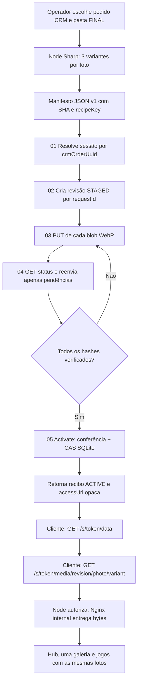
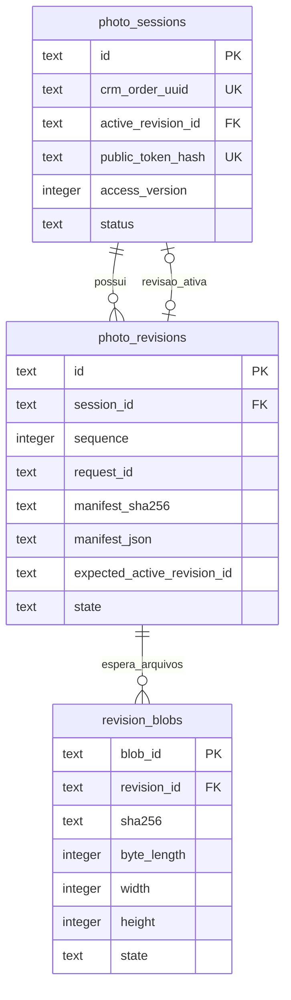

# Point Graph canônico — MVP da galeria e upload Contabo (v1)

**Data:** 2026-10-08. **Estado:** contrato e candidato de migração, **não é API em funcionamento**. **Objetivo:** publicar a primeira sessão REAL manualmente com segurança, sem PHP adicional, Redis, filas ou orquestração Python neste corte.  
**Bases auditadas:** gameplay PR #7 (UI), PR #8 (Contabo), PR #9 (manifesto), `apps/catalog-server/src/CatalogServer.ts`, `AppRouter.tsx`, Node/Sharp, EvydFlow `flows/natal_default.yaml` e `flows/natal_laboratorio.yaml`.  
**Artefatos vinculados:** [OpenAPI proposto](../../contracts/mvp-photo-publication-v1.openapi.json), [SQL de três tabelas](../../../apps/catalog-server/migrations/001_mvp_photo_sessions.sql) e [manifesto estrito preflight](../../contracts/photo-publication-manifest-v1.schema.json). A versão anterior `SESSION_MEDIA_PUBLICATION_CONTRACT_V1.md` contém um escopo futuro maior; **este Point Graph MVP é a referência para o primeiro corte**.

## 1. Decisões de redução de escopo

| Decisão        | MVP agora                                                         | Deixar para depois                                 |
| -------------- | ----------------------------------------------------------------- | -------------------------------------------------- |
| Autoridade     | `apps/catalog-server` já existente                                | Microserviço adicional                             |
| Persistência   | SQLite local, 1 writer, 3 tabelas                                 | ORM/Redis/PostgreSQL, fila distribuída             |
| Modelo         | 1 pedido CRM = 1 sessão/galeria; revisões imutáveis               | Subgalerias, permissões por múltiplos usuários     |
| Fotos          | 3 variantes WebP Node/Sharp no Windows; servidor não redimensiona | Upload de RAW/originais, AVIF, deduplicação global |
| Upload         | PUT do arquivo completo, checksum, replay seguro                  | Protocolo de chunks, tus, multipart por partes     |
| API privada    | **5 endpoints** Tailscale/HTTPS + bearer de publicador            | Painel/admin público, webhooks complexos           |
| API de leitura | **2 endpoints** sob capability token + HTML existente             | OAuth, refresh token, sessão por cookie            |
| Publicação     | Node CLI manual com recibo                                        | EvydFlow/Python automático e WhatsApp              |
| Visibilidade   | Mesmo Hub, galeria única, jogos existentes                        | Redesign adicional da galeria                      |

**Não minimizar os controles essenciais:** upload não pode ser público; validar CRC/SHA, MIME real, dimensões e autorização; CAS da revisão; isolamento A/B; logs sem token; backup/restore testado; rollback. O menor MVP **seguro** continua dependendo de testes de cliente real antes do piloto.

## 2. Point Graph: componentes, etapas e dependências



Falha em D–I nunca publica parcialmente; A1 permanece ativa enquanto A2 estiver STAGED. Falha de H interrompe o lote com código explícito. No MVP o operador decide quando compartilhar o link — **não enviar WhatsApp nesta etapa**.

## 3. SQLite: três tabelas e todos os vínculos



| Tabela            | O que armazena                                                                                             | Unicidade/relacionamento                                                        |
| ----------------- | ---------------------------------------------------------------------------------------------------------- | ------------------------------------------------------------------------------- |
| `photo_sessions`  | Um pedido CRM validado, sessão estável, token **somente hash**, revisão ativa, revogação, versão de acesso | `crm_order_uuid UNIQUE`; `active_revision_id` deve pertencer à **mesma sessão** |
| `photo_revisions` | A1/A2/A3, `request_id` idempotente, SHA do manifesto, manifesto JSON validado, revisão esperada e estado   | `(session_id,sequence) UNIQUE`; `(session_id,request_id) UNIQUE`                |
| `revision_blobs`  | Uma variante esperada por `blobId`: SHA, bytes, dimensão, EXPECTED/READY                                   | `blob_id PRIMARY KEY`; revisão tem vários blobs                                 |

Por que não ter tabelas `photos`, `session_grants`, `audit_events` agora? O manifesto imutável da revisão já contém foto, posição e vínculo com os `blobId`; as consultas do MVP são por **sessão ativa**, não por catálogo histórico. Não há compartilhamento por usuário nem consentimento de foto social (continua prévia genérica). Logs de decisão sem PII atendem à operação inicial. Expanda tabelas quando aparecer necessidade real, com migração versionada.

**Mapeamento obrigatório:** `manifest_json.photos[*].variants.{thumb,card,game}.blobId` identifica exatamente 3 arquivos por foto em `revision_blobs`. A API deve conferir igualdade completa de conjuntos: nenhuma variante sobrando ou faltando. Ordem da galeria vem de `photos[*].sortIndex` (0..N-1).

**Segurança da leitura:** `publicToken` é capability aleatória derivada por HMAC-SHA256 de segredo do servidor, ID da sessão e `access_version`; guarda apenas `SHA-256(token)` no banco. O backend consegue reconstruir o link sob escopo de publisher. Quando revogado, incrementa `access_version`, atualiza hash e muda status para REVOKED. O segredo HMAC é protegido fora do Git; definir reemissão controlada se mudar a chave. Nunca derivar token só do UUID sem segredo.

**SQLite:** `PRAGMA foreign_keys=ON` por conexão; `journal_mode=WAL` e `busy_timeout` configurados na inicialização (filesystem local, não NFS). Usar `BEGIN IMMEDIATE` durante a ativação e operação CAS. Só um processo escritor na VPS. O candidato SQL é executado **apenas em banco vazio**, depois de revisão de migração e backup. `node:sqlite` 24.21.0 é _release candidate_ (API síncrona); usar por trás de SessionRepository, executar somente queries curtas e **não bloquear o loop HTTP com manipulação pesada de imagens**.

## 4. Cinco endpoints internos mínimos (ainda não implementados)

**Host:** HTTPS privado e acessível somente pelo Tailscale/allowlist autenticada. **Headers comuns:** `Authorization: *** `Content-Type: application/json`(salvo PUT). O Caddy público bloqueia`/internal/*`; não habilitar CORS nessa API. Segredo separado da capability da família. Cada erro é JSON `{ "code": "...", "message": "...", "requestId": "UUID" }` sem caminho local, telefone, cliente ou token.

### 01. POST /internal/v1/sessions/resolve

**Faz:** confere UUID no CRM, valida direito de publicar o pedido e localiza/cria **uma** sessão. Não envia mídia. Se CRM indisponível, não cria.

**Body**

```json
{ "crmOrderUuid": "33333333-3333-4333-8333-333333333333" }
```

**201 criado / 200 já existe**

```json
{
  "sessionId": "11111111-1111-4111-8111-111111111111",
  "activeRevisionId": null,
  "status": "ACTIVE"
}
```

Erros: 401 não autorizado; 404 pedido inválido; 503 integração CRM indisponível. O EvydFlow possui `orders.detail`, mas sua URL/UUID devem ser auditados no CRM antes de codificar.

### 02. POST /internal/v1/publications

**Faz:** usa o `PublicationManifestV1` do PR #9 com `sessionId` resolvido, `requestId` fixo para retry, `expectedActiveRevisionId`, receita e fotos. Persiste revisão STAGED e os três blobs EXPECTED por foto. O `requestId` deve ser gerado **uma vez por tentativa de revisão**; no replay com JSON semanticamente equivalente devolver a mesma revisão e comparar digest canônico.

**Body simplificado para UMA foto — somente exemplo**

```json
{
  "schemaVersion": 1,
  "requestId": "33333333-3333-4333-8333-333333333333",
  "sessionId": "11111111-1111-4111-8111-111111111111",
  "expectedActiveRevisionId": null,
  "recipeKey": "recipe-1-webp82-srgb-inside",
  "photos": [
    {
      "photoId": "photo-01",
      "contentHash": "bbbbbbbbbbbbbbbbbbbbbbbbbbbbbbbbbbbbbbbbbbbbbbbbbbbbbbbbbbbbbbbb",
      "sortIndex": 0,
      "width": 1600,
      "height": 1200,
      "variants": {
        "thumb": {
          "blobId": "22222222-2222-4222-8222-222222222222",
          "sha256": "aaaaaaaaaaaaaaaaaaaaaaaaaaaaaaaaaaaaaaaaaaaaaaaaaaaaaaaaaaaaaaaa",
          "byteLength": 123456,
          "width": 480,
          "height": 360
        },
        "card": {
          "blobId": "33333333-3333-4333-8333-333333333333",
          "sha256": "aaaaaaaaaaaaaaaaaaaaaaaaaaaaaaaaaaaaaaaaaaaaaaaaaaaaaaaaaaaaaaaa",
          "byteLength": 123456,
          "width": 800,
          "height": 600
        },
        "game": {
          "blobId": "44444444-4444-4444-8444-444444444444",
          "sha256": "aaaaaaaaaaaaaaaaaaaaaaaaaaaaaaaaaaaaaaaaaaaaaaaaaaaaaaaaaaaaaaaa",
          "byteLength": 123456,
          "width": 1600,
          "height": 1200
        }
      }
    }
  ]
}
```

**201 criada / 200 replay igual**

```json
{
  "revisionId": "22222222-2222-4222-8222-222222222222",
  "sessionId": "11111111-1111-4111-8111-111111111111",
  "state": "STAGED",
  "expectedBlobs": 3,
  "readyBlobs": 0,
  "pendingBlobIds": [
    "22222222-2222-4222-8222-222222222222",
    "33333333-3333-4333-8333-333333333333",
    "44444444-4444-4444-8444-444444444444"
  ]
}
```

409 para `requestId` reutilizado com payload diferente, sessão/revisão obsoleta; 422 manifesto inválido. O validador `parsePublicationManifestV1` já existe.

### 03. PUT /internal/v1/publications/{revisionId}/blobs/{blobId}

**Faz:** recebe **um WebP completo**, em stream binária (sem JSON/base64), com `Content-Type: image/webp`, `Content-Length` e `X-Content-SHA256`. Confere blob esperado da revisão e autorização do publicador antes de aceitar. Verifica bytes, hash, formato por decoder e dimensões; grava arquivo temporário e promove por rename no mesmo volume privado; atualiza blob READY somente após armazenamento confirmado.

**201** novo blob READY; **200** retransmissão do mesmo hash/bytes; 401, 404, 409, 413, 422, 429 conforme situação. **Não adicionar chunks na primeira versão.** Arquivos de até 12 MiB cabem em PUT completo com reenvio seguro. Limitar concorrência do CLI a 2, ajustar com medições.

### 04. GET /internal/v1/publications/{revisionId}

**Faz:** fornece progresso de upload e lista dos IDs faltantes para resumir uma sessão interrompida. Não retorna paths nem dados pessoais.

**200**

```json
{
  "revisionId": "22222222-2222-4222-8222-222222222222",
  "sessionId": "11111111-1111-4111-8111-111111111111",
  "state": "STAGED",
  "expectedBlobs": 3,
  "readyBlobs": 2,
  "pendingBlobIds": ["44444444-4444-4444-8444-444444444444"]
}
```

### 05. POST /internal/v1/publications/{revisionId}/activate

**Faz:** compara expectedActiveRevisionId; verifica que todos os blobs estão READY e que manifesto, hashes e contagem batem; ativa a nova revisão em **transação SQLite**. A1 permanece ativa em qualquer falha anterior. Um replay idêntico de ativação já concluída devolve o mesmo recibo.

**Body**

```json
{ "expectedActiveRevisionId": null }
```

**200**

```json
{
  "sessionId": "11111111-1111-4111-8111-111111111111",
  "revisionId": "22222222-2222-4222-8222-222222222222",
  "state": "ACTIVE",
  "photoCount": 1,
  "accessUrl": "https://jogos.fotosdenatal.com/s/EXAMPLE_OPAQUE_CAPABILITY_NOT_REAL"
}
```

**409** CAS obsoleta; **422** blob faltante; **401** sem auth. `accessUrl` é segredo para distribuição, não deve ir a log. A API não envia WhatsApp: operador copia link após conferir sucesso.

## 5. Dois endpoints públicos (também planejados)

### GET /s/{token}/data

Retorna **o formato Session já definido em `packages/platform/src/contracts/index.ts`** (`id,publicToken,displayName,photos`), com `photos[*].variants.thumb/card/game`, aspecto natural e ordem do manifesto. Sem nome de cliente, CRM, caminho Windows ou links de fotos originais.

```json
{
  "id": "11111111-1111-4111-8111-111111111111",
  "publicToken": "EXAMPLE_OPAQUE_CAPABILITY_NOT_REAL",
  "displayName": "Seu Álbum de Natal",
  "photos": [
    {
      "id": "photo-01",
      "width": 1600,
      "height": 1200,
      "aspectRatio": 1.333333,
      "orientation": "landscape",
      "variants": {
        "thumb": "/s/EXAMPLE_OPAQUE_CAPABILITY_NOT_REAL/media/22222222-2222-4222-8222-222222222222/photo-01/thumb",
        "card": "/s/EXAMPLE_OPAQUE_CAPABILITY_NOT_REAL/media/22222222-2222-4222-8222-222222222222/photo-01/card",
        "game": "/s/EXAMPLE_OPAQUE_CAPABILITY_NOT_REAL/media/22222222-2222-4222-8222-222222222222/photo-01/game"
      }
    }
  ]
}
```

O React atual **usa `createFixtureSession()` fora do Gallery Lab**; isso é um blocker real: implementar um carregador `fetchSession` fail-closed antes de habilitar cliente. Em produção, nunca usar fixture quando o token não resolver. `Cache-Control: private, no-store`, `X-Robots-Tag: noindex`, `Referrer-Policy: no-referrer`.

### GET /s/{token}/media/{revisionId}/{photoId}/{variant}

Valida token hash e status ACTIVE, revisionId exata da sessão ativa, photoId e `thumb|card|game` existentes no manifesto; busca `blob_id`, confere arquivo READY e retorna **`X-Accel-Redirect`** para location `internal` do Nginx que monta mídia privada. Para token de B acessando foto A ou revisão antiga: sempre 404. O Nginx não deve ter localização estática pública para `/_private_media/`.

**Atenção:** o proxy Nginx atual só atende `/s/{token}`, `/fotos`, `/game` e `/social-preview` no matcher. **Incluir explicitamente essas duas rotas** e não mudar rotas públicas existentes. O servidor HTTP Node atual aceita GET/HEAD; implementar novos GET separados sem abrir POST no hostname público.

## 6. Erros HTTP e regras de retry

| HTTP                | Código estável                            | Ação no Node CLI                                      |
| ------------------- | ----------------------------------------- | ----------------------------------------------------- |
| 400/422             | `INVALID_MANIFEST`, `INVALID_MEDIA`       | STOP; corrigir conteúdo                               |
| 401/403             | `PUBLISHER_UNAUTHORIZED`                  | STOP; renovar credencial pelo operador                |
| 404                 | `SESSION_NOT_FOUND`, `REVISION_NOT_FOUND` | STOP; não inventar pedido                             |
| 409                 | `IDEMPOTENCY_CONFLICT`, `STALE_REVISION`  | STOP; verificar revisão ativa antes de nova tentativa |
| 413                 | `QUOTA_EXCEEDED`                          | STOP; reduzir derivados                               |
| 429                 | `RATE_LIMITED`                            | Retry com backoff e `Retry-After`                     |
| 500/502/503/504     | `INTERNAL_ERROR` ou indisponibilidade     | Consultar status; retry limitada e idempotente        |
| Timeout durante PUT | Sem resposta confiável                    | GET status; reenvie apenas `pendingBlobIds`           |

**Proibido:** gerar um novo `requestId` a cada timeout; isso criaria revisões duplicadas. **Proibido:** considerar `201 STAGED` conclusão do trabalho. O único sucesso de negócio é `ACTIVE`.

## 7. Pastas mínimas na VPS

```text
/srv/platform/stacks/christmas-games/      # compose/config de infra
/srv/runtime/christmas-games/releases/     # bundles imutáveis
/srv/runtime/christmas-games/data/         # SQLite local, WAL e SHM
/srv/runtime/christmas-games/media/
  incoming/                                # temporários de upload
  blobs/                                   # somente WebP verificados, IDs opacos
/srv/secrets/christmas-games/              # segredo publisher e HMAC fora do Git
/srv/backups/christmas-games/              # snapshot e blobs, cópia offsite
```

Reconciliar layout com o dono real da plataforma antes de criar os diretórios. **Sem portas host adicionais.** A stack de staging existente é read-only e continua sem diretório de cliente; somente perfil de piloto após autorização terá mounts graváveis de SQLite e `incoming`. O Nginx lê `blobs` em modo readonly.

## 8. Plano de execução: 4 PRs funcionais, não 10

**Corte 1 — SQLite e testes (primeiro):** aplicar migração candidata, criar SessionRepository com transações SQLite, helpers de token, A1/A2/B, idempotência, restart e revogação. Tests verdes. **Não ligar rotas de cliente**.

**Corte 2 — API publisher + bytes:** endpoints 01–05, auth Tailscale/secret, limites, upload completo, SHA/MIME/decoder, tmp+rename, status/retry e activate com CAS. Testar via cliente Node local e API privada sem dados reais.

**Corte 3 — leitura + UI:** `/data`, `/media`, X-Accel interno, rotas Nginx, React `fetchSession` (sem fallback fixture), galeria única, fotos em coluna única, portrait/landscape, jogos/Lightbox. Testar Android/Safari, A/B.

**Corte 4 — publisher Node manual e piloto supervisionado:** CLI que usa Node/Sharp da Gallery Lab; CRM order UUID confirmado, manifesto canônico e uploads; status/receipt ACTIVE; teste de backup/restore; autorização explícita para primeiro pedido real. **Python/WhatsApp ficam para um próximo PR opt-in**, sem alterar o YAML de produção neste MVP.

## 9. Critérios de aceite objetivos

1. Pedido A com 30 fotos A1: 90 variantes WebP, antes da ativação 404; após ativação 200 no Hub, galeria e jogos.
2. A2 do mesmo pedido muda 3 fotos: A1 continua ativa durante upload; CAS ativa A2 sem trocar o link da galeria; nenhuma mistura de revisões.
3. Pedido B 12 fotos: token B nunca acessa A; inexistente/revogado expõe 404 e nenhum caminho interno.
4. Interromper na variante 45/90: executar CLI outra vez com mesmo `requestId`; nenhum reenvio dos 44 blobs prontos e nenhum duplicado.
5. Reenviar o mesmo `requestId` com manifesto diferente => 409; upload WebP inválido/hash errado => 422; 13 MiB => 413.
6. Testar 390px, 412px, 430px e 768px; fotos retrato/paisagem sem corte; Hub → Galeria → foto → Hub → jogo.
7. Backup consistente e restore de sessão A2 + blobs; SHA e acesso após restore aprovados; uso de CPU/RAM/disco e efeitos nos outros serviços mensurados.
8. `pnpm agent:doctor`, `pnpm check`, E2E galeria/multi, build e release verify sem regressões, prontidão de piloto ainda **false** até a homologação do operador.

## 10. Documentação oficial confrontada

- Node 24.21 SQLite (release candidate 1.2): https://nodejs.org/download/release/latest-v24.x/docs/api/sqlite.html
- HTTP streams, limits e timeouts: https://nodejs.org/download/release/latest-v24.x/docs/api/http.html
- SQLite CREATE TABLE, FKs e WAL: https://www.sqlite.org/lang_createtable.html ; https://www.sqlite.org/foreignkeys.html ; https://www.sqlite.org/wal.html
- Backup SQLite: https://www.sqlite.org/backup.html
- Nginx internal/X-Accel-Redirect: https://nginx.org/en/docs/http/ngx_http_core_module.html
- Caddy log e proteção de URI: https://caddyserver.com/docs/caddyfile/directives/log
- Docker Compose health/read_only: https://docs.docker.com/reference/compose-file/services/
- OpenAPI 3.1: https://spec.openapis.org/oas/v3.1.1.html

**Stop:** sem sessão CRM comprovada, sem TLS interno, sem backup testado, sem hostname público isolado, com dados reais em staging-demo ou qualquer falha de isolamento A/B. Nenhum merge/deploy automático.
