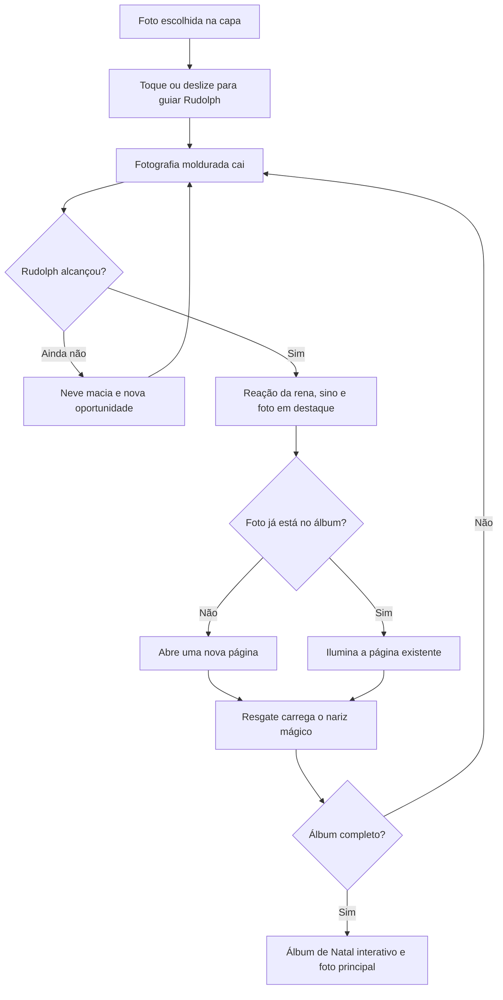

# Rudolph — Chuva de Lembranças

**Data:** 2026-09-07.  
**Estado:** especificação de criação; implementação ainda não iniciada.  
**Owner previsto:** `packages/games/rena-das-lembrancas`.  
**Plano de execução:** [CG-RUDOLPH-CHUVA-DE-LEMBRANCAS](../exec-plans/CG-RUDOLPH-CHUVA-DE-LEMBRANCAS.md).

## 1. Decisão de produto

A fotografia cai dentro de uma moldura; a criança conduz Rudolph pelo toque;
Rudolph salva a lembrança; a fotografia aparece em destaque e ocupa uma página
do Álbum de Natal. A rodada termina quando todas as fotografias diferentes do
álbum daquela rodada forem salvas.

O proprietário confirmou em 2026-09-07: **“Ao completar o álbum, com fotos
repetidas durante a rodada.”** Repetições são parte da brincadeira. Cada
resgate conta para a magia de Rudolph, mas a mesma fotografia não ocupa duas
páginas nem substitui uma foto que falta. Exemplo: 12 resgates podem completar
um álbum de 8 fotos diferentes. O total de resgates aparece como celebração
secundária no final, sem ranking, nota ou comparação entre crianças.

Nome de apresentação: **Rudolph — Chuva de Lembranças**. Identificador técnico
proposto: `rena-das-lembrancas`, consistente com a proposta recebida. Público
principal: crianças de 6–10 anos, conforme a direção vigente do projeto;
controles tolerantes também serão observados com crianças menores acompanhadas.

Esta entrega define o jogo e sua produção. Os recursos abaixo são requisitos
futuros; não significam que sprites, áudio ou gameplay já foram produzidos.

## 2. Promessa e primeiros cinco segundos

> “As fotos de Natal escaparam do trenó! Ajude Rudolph a salvar suas lembranças.”

Na capa, a fotografia escolhida já aparece inteira em uma moldura, com Rudolph
na base e uma demonstração curta que responde ao toque. A instrução principal
é **“Toque ou deslize para guiar Rudolph.”** O botão **“Salvar lembranças”** tem
ao menos 52 CSS px e a resposta cristalina do projeto. A capa não cria Phaser.

Ao começar, Rudolph responde ao primeiro toque imediatamente. A primeira
fotografia é a escolhida no Hub, cai sozinha, lentamente e em região alcançável.
A instrução some após o primeiro resgate; volta apenas como dica contextual.
Áudio começa somente após o gesto de início e respeita a preferência da sessão.

Verbos da criança: **guiar, salvar, ativar magia, descobrir e rever fotos**.
Duração inicial desejada: aproximadamente 60–100 segundos para 8 fotos, a
calibrar em partidas reais. Não existe cronômetro de derrota nem encerramento
automático por demora; fotos que escapam voltam.

## 3. Caminho completo da experiência

A primeira versão completa inclui o ciclo acima, três tamanhos de moldura,
Rudolph animado, nariz mágico acionável, passagem de Papai Noel com uma
lembrança dourada, música, efeitos sonoros e álbum navegável. Boneco geométrico,
som genérico ou fotografia que simplesmente desaparece servem apenas a ensaios
de engenharia e não encerram a entrega.

Sinos e estrelas podem existir como detalhes de cenário que respondem ao
toque. Objetos colecionáveis extras e bolas de neve que atingem a rena ficam
fora da V1: as fotografias já sustentam a variação de tamanho, percurso, magia
e repetição. A V1 não precisa diminuir o controle da criança para criar desafio.

## 4. Fotografias, repetições e conclusão

### 4.1 Álbum de uma rodada

- Configuração proposta: `minPhotos: 3`, `recommendedPhotos: 8`, seleção
  `subset`, orientações mistas habilitadas. Abaixo de 3 fotos elegíveis, a capa
  explica a indisponibilidade; não inventa fotos nem páginas duplicadas.
- Com 3–7 fotos elegíveis, usar todas; com 8 ou mais, escolher até 8. A foto
  selecionada sempre entra. Deduplicar por identificador autorizado antes da
  seleção. Não confundir o álbum da rodada com todo o catálogo da sessão.
- Seleção e ordem usam uma fonte aleatória semeada, isolada da decoração. O
  domínio recebe ids opacos, nunca `Photo`, pixels, URLs ou nomes de clientes.
- O HUD mostra somente o progresso fotográfico, por exemplo **“Álbum 4 de 8”**,
  miniaturas já salvas e espaços vazios. Não há um segundo placar em React.
- A mesma foto pode voltar em tamanho e percurso diferentes. Ela conserva a
  orientação e a proporção original. Mudar tamanho não muda a recompensa.

### 4.2 Regra operacional para repetição justa

O planejador mantém três fontes: fotos ainda não apresentadas, fotos que
escaparam e fotos já salvas. A primeira queda usa a âncora. Depois, cada bloco
de três oportunidades de foto reserva pelo menos duas para fotos que ainda
faltam; a terceira pode repetir uma já salva. Sem foto salva elegível, usar
uma faltante. Não consumir aleatoriedade de gameplay para efeitos visuais.

Uma foto que escapou volta depois de 2–4 outras quedas de foto, mais lenta e
em corredor alcançável; usar fila com prazo, em vez de depender da sorte. Não
ter duas instâncias da mesma foto caindo ao mesmo tempo. Repetição celebrativa
evita o mesmo id nas duas quedas imediatamente anteriores. Se só faltar uma
foto, priorizar essa foto na próxima vaga e permitir retorno mais cedo quando
necessário; nenhuma regra de cooldown pode bloquear a conclusão.

Essas garantias controlam o que é oferecido, sem salvar automaticamente uma
lembrança. Após tentativas sem captura, reduzir velocidade e aproximar a rota
de Rudolph, mantendo um gesto real da criança. Inatividade suspende novas
quedas e mostra uma dica curta; retomada não despeja objetos acumulados.

### 4.3 Contagens e idempotência

| Dado                | Atualização                                     | Efeito visível                        |
| ------------------- | ----------------------------------------------- | ------------------------------------- |
| `savedPhotoIds`     | Acrescentar id apenas no primeiro resgate       | Nova página e progresso do álbum      |
| `totalRescues`      | Somar uma vez por instância capturada           | Celebração secundária no final        |
| `capturesByPhotoId` | Somar uma vez por instância                     | “Salva 3 vezes” no visor, se útil     |
| `noseCharge`        | Somar por resgate quando a magia não está ativa | Três marcas de carga                  |
| `instanceId`        | Novo a cada queda                               | Impede dupla captura no mesmo contato |

Vitória: `savedPhotoIds.size === roundPhotoIds.length`. No tick que completa o
álbum, cancelar novos spawns e impedir novas recompensas. A última foto recebe
seu destaque antes do álbum final. `GAME_COMPLETED` é emitido uma única vez,
depois da apresentação final estar pronta. Resize, pausa, gesto repetido ou
callback atrasado não podem repetir captura ou conclusão.

Ao entrar em conclusão, terminar os destaques de capturas já aceitas em sua
ordem, culminando na última foto única; retirar as quedas ainda não capturadas
sem penalidade. A fila limitada impede que essa drenagem se torne uma espera
longa. Pausa e saída continuam imediatas durante a transição.

## 5. Controle por toque e espaço para o dedo

Rudolph segue a posição horizontal indicada pela criança. Um toque simples
define um destino e a rena corre até lá; arrastar atualiza esse destino
continuamente. Aceleração e frenagem suaves, com velocidade máxima, evitam
teletransporte e oscilação. Soltar normalmente mantém o destino; cancelamento,
saída do canvas, pausa ou perda de foco interrompem o comando ativo.

A região de comando fica na neve inferior, abaixo da zona de captura. O dedo
pode ficar abaixo dos cascos sem esconder a fotografia. Tocar no campo livre
também aponta o destino. Tocar numa foto em queda orienta Rudolph para aquele
x; não captura à distância nem abre um modal durante a queda.

| Interação          | Regra                                                                       |
| ------------------ | --------------------------------------------------------------------------- |
| Um dedo            | Primeiro pointer válido conduz; outro dedo não assume o movimento           |
| Dois dedos         | Segundo dedo só pode acionar um controle explícito, sem deslocar a rena     |
| Nariz mágico       | Botão cristalino fixo “Magia”, 52 px; alvo ampliado no nariz é atalho       |
| Toque no nariz     | Só ativa ao soltar dentro do alvo, sem arraste; consome o gesto             |
| HUD, álbum e pausa | Consomem o gesto; não mandam Rudolph correr por baixo                       |
| Desktop            | Setas esquerda/direita; Espaço ativa magia; teclado funciona sem foco preso |
| Ajuda              | Após inatividade, mostrar dedo/destino uma vez; nunca jogar pela criança    |

Não misturar controle por destino com “metade esquerda/metade direita” no
mesmo gesto. O toque simples já é a alternativa acessível ao arraste. Controle
por metades fica como experimento posterior, somente se a revisão com crianças
mostrar necessidade.

Colisão é geométrica e tolerante, independente do contorno e dos chifres do
sprite. Começar com uma faixa de captura de aproximadamente 125% da largura
do corpo visual, à altura da cabeça/cesto de luz. Medir no celular e ajustar
sem capturar algo visivelmente distante. Animação e brilho não ampliam a regra
de contato por acidente.

## 6. Queda, tamanhos e destaque da fotografia

Usar `PhotoSurface(..., 'contain')`. Retrato, paisagem e quadrado respeitam as
dimensões da foto; 15 × 21 e 21 × 15 são referências do acervo, não razões
obrigatórias para toda imagem. Passe-partout ocupa apenas a abertura interna.
Nenhum filtro, tint, partícula, reflexo, neve, texto ou personagem cobre os
pixels da fotografia. Fotografias em queda não se sobrepõem entre si.

Pontos de partida para layout, em CSS px equivalentes; ajustar a partir da
janela fotográfica real, sem esticar a moldura:

| Papel           | Tamanho e movimento iniciais                          | Limite                                        |
| --------------- | ----------------------------------------------------- | --------------------------------------------- |
| Moldura pequena | Lado maior externo 108–124 px                         | Abertura precisa manter a foto reconhecível   |
| Moldura média   | Lado maior 140–156 px                                 | Frequência maior que os outros tamanhos       |
| Moldura grande  | Lado maior 172–190 px                                 | Uma por vez; queda mais lenta                 |
| Queda comum     | Percurso de cerca de 3,5–5 s                          | Primeira queda 5–6 s; sem aceleração infinita |
| Oscilação       | Lateral pequena, cerca de 4–10 px; inclinação até ±4° | Sem girar a foto de costas                    |
| Espaçamento     | Nova oportunidade a cada 1,8–2,4 s quando há espaço   | Aumentar intervalo antes de diminuir fotos    |
| Campo           | Até 3 fotos simultâneas; até 2 em telefone baixo      | Mesma regra em LOW, NORMAL e HIGH             |

O planejador verifica abertura, amplitude e limites laterais antes de lançar
a foto. O corredor até a faixa de captura precisa ser alcançável considerando
a velocidade da rena. Dois objetos não exigem chegada simultânea em extremos
opostos. A geometria do percurso reserva uma área superior para o destaque,
sem passar por trás da foto ampliada ou por baixo do HUD.

### 6.1 Uma captura comum

1. No contato: retirar a instância da colisão, registrar o resgate e reagir
   imediatamente com Rudolph, luz do nariz e um único sino de captura.
2. Moldura recebe acomodação breve, com até 6–10 faíscas externas em NORMAL.
   Haptic `correct` é complementar e opcional.
3. A foto aparece proporcional na área superior reservada por aproximadamente
   650–850 ms; uma repetição recebe 450–600 ms e continua reconhecível.
4. A moldura percorre uma curva curta até sua miniatura. Foto inédita abre a
   página; foto repetida ilumina a página existente. O HUD se acomoda uma vez.

A simulação e o controle continuam durante o destaque comum. Não aplicar
slow-motion global a cada captura. Aumentos de fotografia nunca roubam o
controle da rena. Manter uma apresentação de foto por vez, fila de até três e
um limite total de quatro entre objetos em queda e apresentações em andamento.
Se os créditos se esgotarem, adiar spawns; não descartar uma foto capturada nem
criar uma fila de celebrações sem limite. Todos os resgates têm feedback imediato.

No chão, a moldura pousa em neve macia, com puff atrás da borda e som suave.
A fotografia continua intacta até sair de cena. Nenhuma foto quebra, recebe
marca de erro ou é apagada do álbum.

### 6.2 Nariz mágico

Três resgates, inclusive repetições, deixam a magia pronta. A carga não expira.
O nariz e o botão “Magia” indicam a mesma disponibilidade; não são dois poderes.
O pulso de aviso é finito, com estado estático depois. A ativação dura cerca de
3 segundos de simulação ativa e não acumula nova carga durante esse período.

A magia atrai molduras próximas horizontalmente, com raio e velocidade limitados,
e desacelera suavemente sua queda. Rudolph ainda precisa estar perto. O domain
controla a atração; o renderer apenas desenha trilhas fora das fotografias.
Capturas continuam individuais e passam pelo mesmo controle de fila. Ativar
durante pausa ou no final não gasta carga; entradas repetidas não reativam.

### 6.3 Papai Noel e a lembrança dourada

Ao atingir aproximadamente metade das fotos diferentes, agendar uma passagem
única de Papai Noel. Esperar uma janela livre, suspender spawns comuns e terminar
as apresentações pendentes. O trenó cruza o fundo superior com sinos e entrega
uma versão dourada da foto escolhida. É a mesma foto, portanto usa a mesma
página e carrega magia como um único resgate.

A moldura dourada cai sozinha, mais devagar, num percurso alcançável. Se escapar,
volta; não se transforma em captura automática. Ao ser salva, sua fotografia
ocupa uma caixa de destaque com 70–80% da largura útil, respeitando também a
altura disponível e `contain`, por cerca de 1,2–1,5 s. Essa pausa de contemplação
não deixa outros objetos caindo. Pausa, som e saída continuam disponíveis.

Conclusão tem prioridade sobre um evento especial ainda não iniciado; um álbum
pequeno ou a última captura rápida não deve ficar aguardando Papai Noel. O
evento dourado não é uma página extra obrigatória para vencer.

## 7. Direção visual e sprites profissionais

Noite azul profunda, neve macia, pinheiros nas bordas, vila distante e janelas
âmbar. Materiais: madeira de nogueira, latão fosco, veludo framboesa e vidro
espelhado dos controles. O campo central tem contraste calmo para destacar as
fotos. A rena é um brinquedo de diorama acolhedor, com nariz vermelho luminoso,
volume, cascos apoiados no chão e expressão legível no tamanho real de celular.

Rudolph precisa de uma folha de modelo: frente, perfil, vista de três quartos,
paleta, proporções, chifres, luz e pivô dos cascos. Produzir a animação a partir
de um desenho/rig ou modelo coerente, depois exportar os frames. Imagens de IA
geradas isoladamente por pose não atendem à continuidade necessária da corrida.

| Estado          | Entrega visual                          | Critério de acabamento                 |
| --------------- | --------------------------------------- | -------------------------------------- |
| Parado          | Respiração sutil e piscada ocasional    | Sem “flutuar” no chão                  |
| Correndo        | Ciclo de 8–12 frames, nos dois sentidos | Passadas legíveis e sem salto de pivô  |
| Mudando direção | Frenagem e troca curta de pose          | Sem escorregar ou vibrar no destino    |
| Salvando        | Cabeça se ergue e corpo acomoda         | Não trava o comando de movimento       |
| Magia pronta    | Nariz aceso e aviso finito              | Não depende só de vermelho             |
| Magia ativa     | Pose e halo externo com fonte no nariz  | Não pinta o rosto da fotografia        |
| Interação livre | Orelha/cabeça responde ao carinho       | Fim definido e sem recompensa de regra |
| Comemoração     | Salto curto e pose junto ao álbum       | Foto final aparece primeiro            |

Frame rate de animação e velocidade de deslocamento serão calibrados juntos.
A meta inicial da corrida é 12–18 frames de animação por segundo, desenhada
num loop coerente; isso é diferente do frame rate de renderização do jogo.
Espelhar sprites somente se iluminação e acessórios permitirem; senão entregar
as duas direções. Cada folha tem padding transparente, pivô consistente e
escala suficiente para a maior exibição prevista, inclusive telas de DPR alto.

As molduras de retrato/paisagem já pertencem ao projeto e fornecem a referência
material. Preparar as versões pequena/média/grande por escala proporcional,
validando o alpha da abertura. Versão dourada ganha acabamento no aro; não
recebe filtro sobre a foto. A pose de captura, o trenó e o álbum usam a mesma
direção de luz. A contagem de frames não substitui inspeção de qualidade.

### 7.1 Composição mobile

- Topo seguro: sair, som e pausa cristalinos; progresso em uma única faixa
  fotográfica. Sem título repetido durante a partida.
- Parte superior do campo: área reservada ao destaque. Nenhuma queda cruza
  uma foto em contemplação.
- Centro: corredores de queda com margens calculadas pelo maior objeto.
- Base: Rudolph e faixa de captura; abaixo, espaço para o polegar e botão de
  magia afastado da trajetória de movimento.
- Em 360 × 640, reduzir decoração, miniaturas visíveis e concorrência de quedas.
  Nunca compensar espremendo botões ou rostos. O álbum continua acessível.
- Em paisagem, reorganizar o destaque para uma lateral e manter altura útil
  da queda; girar o telefone preserva a rodada. Tablet mantém fotos grandes.

## 8. Interatividade com causa e resposta

“Interatividade total” significa que cada objeto que convida ao toque tem uma
resposta clara. O jogo continua com uma ação principal; cenário não disputa o
gesto de guiar Rudolph.

| Objeto            | Gesto e resposta                             | Som / limite                                  | Pausa e modo reduzido                                |
| ----------------- | -------------------------------------------- | --------------------------------------------- | ---------------------------------------------------- |
| Rudolph           | Guiar; toque breve em repouso mexe orelha    | Passada discreta, carinho com cooldown de 1 s | Pose estática; movimento necessário preservado       |
| Nariz / Magia     | Soltar ativa carga pronta                    | Uma assinatura, sem empilhar loops            | Não ativa em pausa; indicação estática               |
| Foto em queda     | Toque indica destino horizontal              | Confirmação visual de direção                 | Não abre visor durante queda                         |
| Miniatura / Álbum | Abre visor das fotos salvas                  | Papel curto; sem nova carga                   | Suspende simulação; fechar restaura a pausa anterior |
| Luzes laterais    | Toque breve acende um grupo                  | Sino suave; cooldown de 1 s                   | Sem efeito em pausa; realce estático no reduzido     |
| Banco de neve     | Toque breve fora do arraste solta neve local | Puff; um evento a cada 1,5 s                  | Sem partículas em LOW/reduzido                       |
| Trenó             | Toque durante passagem faz Noel acenar       | Um sino; uma vez por passagem                 | Sem novo spawn, score ou prolongamento               |
| Controles         | Pressão, retorno e ação imediata             | Uma voz por ação aceita                       | Sempre acessíveis quando aplicável                   |

Decoração tocável fica fora dos corredores e dos alvos de controles. No banco
de neve, a movimentação tem prioridade: toque pode confirmar destino e gerar
um puff discreto, mas arraste não produz rajada contínua. Toques recusados,
cancelados ou em cooldown não geram sons acumulados.

## 9. Direção sonora

Produzir um conjunto coeso de sons natalinos: sino quente, papel, neve fofa,
madeira e celesta. Música instrumental com emenda limpa e baixa densidade;
sem letra. SFX e música fazem parte do acabamento da V1. Reutilizar arquivos
autorizados somente onde o timbre cumpre o papel; lacunas exigem produção ou
aquisição com proveniência, não um único clique aplicado a tudo.

| Cue                | Intenção                         | Política inicial                                   |
| ------------------ | -------------------------------- | -------------------------------------------------- |
| Toque cristalino   | Confirmar controle               | 80–160 ms; respeitar cancelamento                  |
| Passos na neve     | Dar peso à corrida               | Baixos, espaçados; nunca som por frame             |
| Resgate            | Sino quente e papel acomodando   | 3–4 variações preparadas, uma voz principal        |
| Foto repetida      | Celebrar a lembrança reconhecida | Variação do resgate, volume estável                |
| Chegada ao álbum   | Papel suave                      | Parte da frase sonora do resgate, sem segundo sino |
| Foto na neve       | Retorno gentil                   | Puff curto, mais baixo que captura                 |
| Magia pronta       | Avisar uma vez                   | Celesta curta; sem hum insistente                  |
| Ativação / atração | Nariz se acende                  | Ataque + cauda limitada à magia                    |
| Trenó              | Aproximação e passagem           | Sinos distantes e whoosh discreto                  |
| Dourada            | Momento da fotografia principal  | Assinatura especial, ducking da música             |
| Álbum completo     | Celebração final                 | Frase curta; não reinicia em cada toque            |
| Música             | Ambiente natalino                | Uma instância; loop confortável em replay          |

No máximo uma música e duas vozes SFX simultâneas como ponto de partida.
Prioridade: conclusão/dourada → captura → magia → interface → ambiente. Várias
capturas no mesmo instante geram uma frase sonora composta, sem pilha de sinos;
cada foto conserva seu feedback visual. Interações ambientais cedem a vez.

Reduzir música durante o destaque dourado e a conclusão, com retorno suave ao
nível configurado. O diretor sonoro conserva as instâncias e seus ganhos;
`AudioManager` sozinho não oferece ducking, filas, cooldown ou pausa completa.
Mudo para imediatamente sons em curso, descarta cues atrasados e sincroniza a
preferência com o shell sem remontar o canvas. Retomar não reproduz o que
ocorreu enquanto estava mudo ou oculto. Haptics nunca são obrigatórios.

Voz de Papai Noel é opcional; sinos e aceno já comunicam a passagem. Se houver
voz, deve ser produzida/licenciada para o projeto, gentil e curta, com registro
próprio. Sua ausência não pode impedir compreender ou completar a rodada.

## 10. Álbum final e reencontro com as fotos

A última fotografia recebe o destaque e abre o Álbum de Natal, com Rudolph
pequeno na base. Mensagem: **“Você salvou as lembranças de Natal!”** A foto
escolhida ocupa a área principal, proporcional. Miniaturas representam as
fotos únicas; tocar abre uma página maior. Deslizar ou usar anterior/próxima
permite rever cada lembrança, sem tempo de leitura obrigatório.

O álbum já pode ser consultado durante a rodada, mostrando somente as fotos
salvas e espaços faltantes. Abrir suspende queda, magia e spawn. Fechar não
remove uma pausa manual que já existia. No final, não há simulação de queda.

Ações finais cristalinas: **“Brincar de novo”**, **“Escolher outro jogo”** e o
compartilhamento já suportado pelo shell. Replay cria uma rodada nova e um
novo seed, conserva a foto escolhida e pode variar o subconjunto. Não divulgar
montagem com foto de criança nem criar endpoint de compartilhamento no jogo.

Na V1, o álbum é estado da rodada, mantido em memória. O catálogo de fotos da
sessão continua disponível no Hub. Persistência do progresso após fechar a
página, exportação de álbum e progresso entre jogos exigem trabalho posterior
no servidor autorizado; não estão implicitamente prontos por existir a galeria.

## 11. LOW, movimento reduzido e qualidade verificável

| Perfil             | Conserva                                                                       | Simplifica                                                           |
| ------------------ | ------------------------------------------------------------------------------ | -------------------------------------------------------------------- |
| LOW                | Fotos nítidas, controle, corrida legível, captura, magia, álbum e som opcional | Sem neve ambiente, trilhas ou pós-efeitos; luz material preparada    |
| NORMAL             | Composição completa com efeitos finitos                                        | Até 24 flocos periféricos; limite de partículas compartilhado        |
| HIGH               | Mesmas regras, tamanhos e ritmo                                                | Detalhes extras somente após medição; sem obrigação de shader        |
| Movimento reduzido | Queda reta e movimento horizontal necessários à brincadeira                    | Sem oscilação, inclinação, pulso contínuo, parallax ou voo até o HUD |

No reduzido, Rudolph conserva poses funcionais e deslocamento previsível;
destaque troca de estado sem zoom e sem câmera. O contrato genérico
`sem-movimento-continuo` refere-se aqui à decoração: queda e deslocamento são
inerentes ao jogo. Registrar essa interpretação no `EXPERIENCE.md` e validar
conforto, sem alegar que o jogo se torna estático. Pausa permanece sempre disponível.

“Profissional” exige prova: proporção e alpha corretos, continuidade dos sprites,
resposta real ao dedo, leitura das fotos em tamanho de celular, escuta dos sons
em alto-falante e fone, pausas corretas e fluidez medida. Screenshot isolado,
contagem de frames ou teste DOM não são homologação visual/sonora.

Os números de tempo, tamanho e concorrência deste documento são parâmetros
iniciais de produção. Os budgets de desempenho definitivos serão registrados
após medição, conforme o [contrato de desempenho](../quality/PERFORMANCE_MEASUREMENT_CONTRACT.md).
